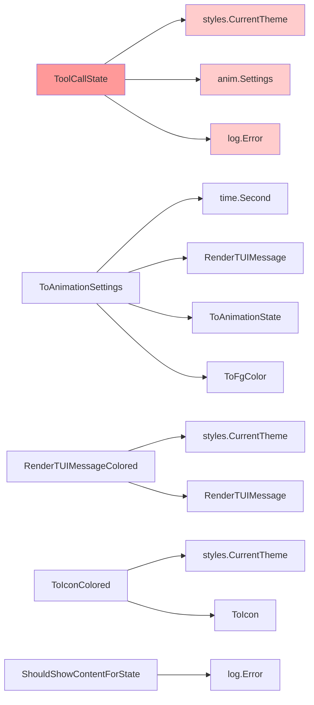
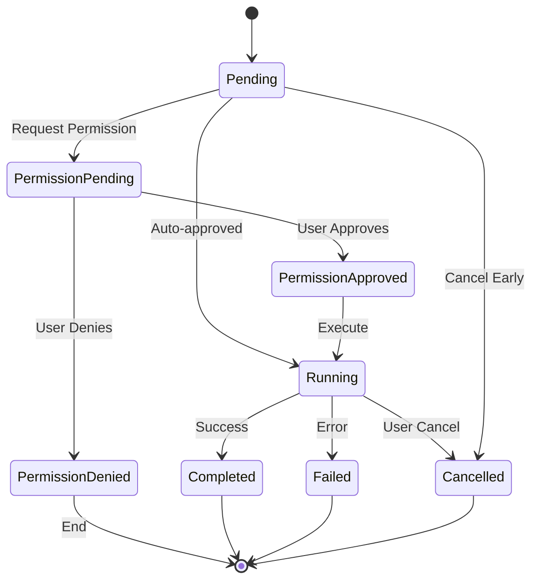
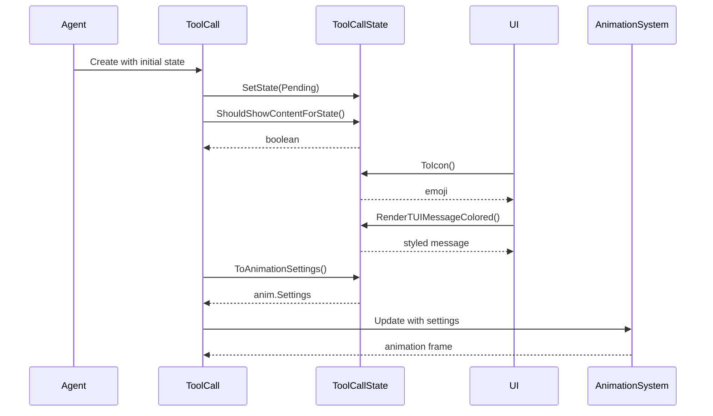

# ToolCallState Call Graph - Current Implementation

## Current Implementation Analysis

The current `ToolCallState` implementation has several architectural issues:

### Problems Identified:
1. **Mixed Concerns** - UI rendering methods mixed with state logic
2. **State Explosion** - 8 states with overlapping responsibilities  
3. **Permission Coupling** - Permission logic tightly coupled with execution state
4. **Complex Methods** - Methods doing too many things (e.g., `ToAnimationSettings`)
5. **Tight Coupling** - Direct dependencies on UI packages from state enum

### Current State Flow:

```mermaid
graph TD
    A[ToolCallState enum] --> B[8 States Total]
    
    B --> C[Permission States]
    B --> D[Execution States]
    B --> E[Final States]
    
    C --> C1[ToolCallStatePermissionPending]
    C --> C2[ToolCallStatePermissionApproved] 
    C --> C3[ToolCallStatePermissionDenied]
    
    D --> D1[ToolCallStatePending]
    D --> D2[ToolCallStateRunning]
    
    E --> E1[ToolCallStateCompleted]
    E --> E2[ToolCallStateFailed]
    E --> E3[ToolCallStateCancelled]
    
    A --> F[UI Methods - MIXED CONCERNS]
    F --> F1[ToIcon]
    F --> F2[ToFgColor]
    F --> F3[ToIconColored]
    F --> F4[RenderTUIMessage]
    F --> F5[RenderTUIMessageColored]
    F --> F6[FormatToolForCopy]
    
    A --> G[State Logic]
    G --> G1[IsFinalState]
    G --> G2[IsNonFinalState]
    G --> G3[String]
    
    A --> H[Content Display Logic]
    H --> H1[ShouldShowContentForState]
    
    A --> I[Animation Integration]
    I --> I1[ToAnimationState]
    I --> I2[ToAnimationSettings]
    
    I1 --> J[AnimationState]
    
    F --> K[styles package]
    I --> L[anim package]
    
    style A fill:#ff9999
    style F fill:#ffcccc
    style I fill:#ffcccc
    style K fill:#ffe6e6
    style L fill:#ffe6e6
```

### Current Method Dependencies:

### Current State Transition Logic:

### Key Issues Highlighted:
- **Red**: State enum with mixed concerns
- **Pink**: UI methods in state enum
- **Light Pink**: External package dependencies from state

### Current Usage Pattern:

### Architecture Issues Summary:
1. **Violation of Single Responsibility Principle** - State enum handles UI, animation, and business logic
2. **Tight Coupling** - Direct dependencies on UI packages makes testing difficult
3. **Mixed Abstraction Levels** - Low-level state mixed with high-level UI concerns
4. **Complex State Logic** - Permission and execution states intertwined
5. **Hard to Extend** - Adding new states requires modifying multiple methods