# Ctrl+A Implementation Flow Chart

## Overview
This document illustrates how Ctrl+A (Select All) works in the Crush TUI application, which has two distinct contexts where Ctrl+A can be triggered:

1. **Editor Component** - Selects all text in the input field
2. **Chat Messages Component** - Selects all messages in the chat list

## Architecture Flow Chart

## Detailed Component Analysis

### 1. Key Detection and Routing

### 2. Editor Select All Implementation

```mermaid
flowchart TD
    A[Ctrl+A in Editor] --> B[key_handlers.go:21]
    B --> C{"key.Matches?"}
    C -->|Yes| D[SelectAll call]
    C -->|No| E[Continue processing]
    
    D --> F[editor.go:502]
    F --> G[selection.SelectAll]
    
    G --> H[selection.go:102]
    H --> I[Get textarea content]
    I --> J{"Empty?"}
    J -->|Yes| K[Clear selection]
    J -->|No| L[Set bounds 0→len runes]
    
    L --> M[Mark as inactive]
    M --> N[Ready for copying]
    
    N --> O[Rendering system]
    O --> P[Apply highlighting]
    P --> Q[Display to user]
    
    E --> R[isHandledKey = true]
    R --> S[Prevent textarea override]
```

### 3. Chat Select All Implementation

## Key Design Principles

### 1. Unicode Safety
- All text operations use `[]rune` instead of byte indices
- Proper handling of multi-byte Unicode characters
- Selection bounds work with character positions, not byte positions

### 2. Component Isolation
- Editor and Chat handle SelectAll independently
- Each component maintains its own selection state
- Shared styling system but independent logic

### 3. Performance Considerations
- Lazy rendering of selection highlights
- Efficient bounds validation
- Minimal state updates

### 4. Cross-Platform Compatibility
- Supports both `ctrl+a` (Windows/Linux) and `cmd+a` (macOS)
- Terminal-agnostic implementation
- Graceful fallback for unsupported terminals

## Recent Improvements (Based on Git History)

1. **True Select All for Chat** - Changed from `height - 1` to `height * 10` to include all scrollable content
2. **Terminal Behavior Override** - Prevents terminal-wide selection, focuses on input field only
3. **Unicode Support** - Proper rune-count based selection for international characters
4. **Enhanced Testing** - Comprehensive BDD tests with proper mock handling

## Error Handling

## Testing Strategy

The implementation includes comprehensive testing:

1. **Unit Tests** - Individual component behavior
2. **Integration Tests** - End-to-end key handling flow
3. **BDD Tests** - Behavior-driven scenarios
4. **Performance Tests** - Benchmark selection operations
5. **Cross-Platform Tests** - Verify key bindings work on different platforms

This robust testing ensures the Ctrl+A functionality works reliably across all supported environments and use cases.