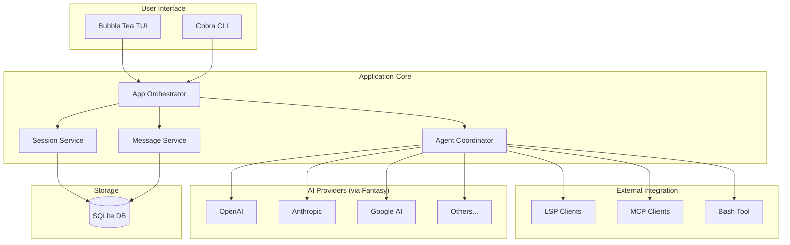

# Architecture & Tech Stack

## System Architecture

Crush follows a modular architecture designed for extensibility and terminal-first interaction.

### Core Components
- **CLI/TUI Layer (`internal/tui`):** Built with Charm's Bubble Tea, Lip Gloss, and Bubbles. It provides the interactive terminal interface.
- **Application Layer (`internal/app`):** Orchestrates the lifecycle of the application, coordinating between the TUI, agents, and background services.
- **Agent Orchestration (`internal/agent`):** Manages the interaction with LLMs, including session history, tool execution, and prompt construction.
- **Fantasy Layer (`charm.land/fantasy`):** A generic abstraction layer for multiple AI providers (OpenAI, Anthropic, Google, etc.).
- **Data Layer (`internal/db`):** Uses SQLite for persistent storage of sessions, messages, and file tracking.
- **Protocol Clients:**
  - **LSP Client (`internal/lsp`):** Communicates with Language Servers.
  - **MCP Client (`internal/agent/tools/mcp`):** Communicates with Model Context Protocol servers.

### Architecture Diagram

## Tech Stack

### Languages & Frameworks
- **Go 1.25.5:** Primary programming language.
- **Charm Libraries:**
  - `bubbletea`: TUI framework.
  - `lipgloss`: Terminal styling.
  - `bubbles`: TUI components.
  - `glamour`: Markdown rendering.
  - `log`: Structured logging.

### Data & Storage
- **SQLite:** Local database for persistence.
- **sqlc:** Type-safe Go code generation from SQL.
- **goose:** Database migrations.

### AI & Protocols
- **Fantasy:** Multi-provider AI abstraction.
- **LSP:** Language Server Protocol for code intelligence.
- **MCP:** Model Context Protocol for tool extensibility.

### Infrastructure & Tooling
- **Cobra:** CLI command structure.
- **Task:** Task runner (replacement for Make).
- **Goreleaser:** Release automation.
- **GitHub Actions:** CI/CD pipelines.
- **Nix (Flakes):** Development environment and packaging.
