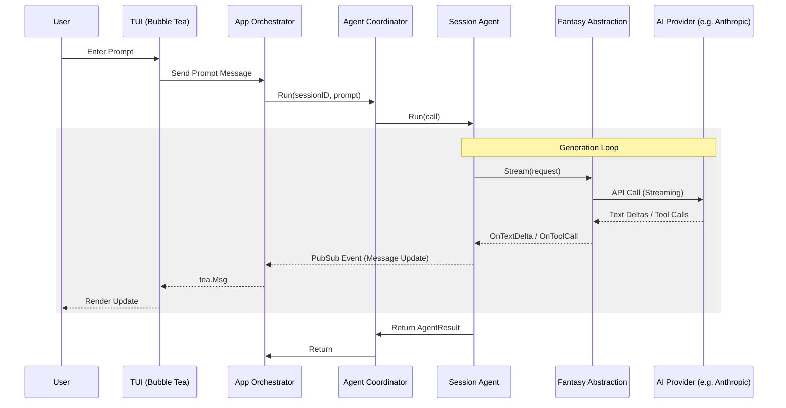

# Data Flow: Request-Response

This diagram illustrates the flow of a user prompt through the system until a response is rendered in the TUI.

## Data Transformation
1. **Prompt Sanitization:** The prompt is combined with system reminders and any project-specific context (from `AGENTS.md` or `.cursorrules`).
2. **Context Assembly:** Previous messages in the session are fetched from SQLite and converted into the provider's message format.
3. **Streaming Deltas:** Responses are received as small chunks (deltas), which are appended to the message state and persisted to the DB incrementally.
