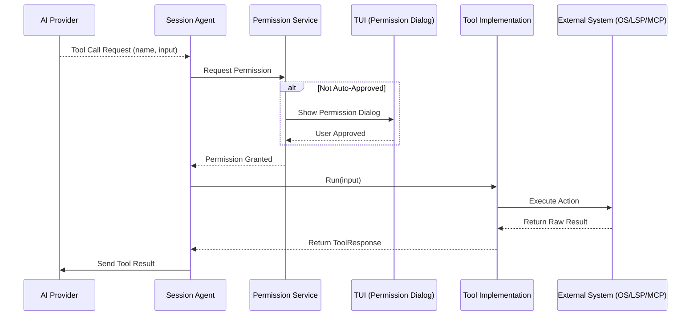

# Data Flow: Tool Execution

This flow describes how the AI agent calls a tool (built-in or MCP) and how the permission system and results are handled.

## Tool Categories

### Built-in Tools
Implemented directly in Go within `internal/agent/tools/`.
- **File Tools:** `view`, `ls`, `grep`, `edit`, `multiedit`, `write`.
- **System Tools:** `bash`, `download`, `fetch`.
- **LSP Tools:** `lsp_diagnostics`, `lsp_references`.

### MCP Tools
Dynamically discovered from external MCP servers.
- **Naming:** Prefixed with `mcp_[server_name]_`.
- **Discovery:** Happens at application startup and refreshes on MCP events.
- **Execution:** Calls the external MCP server over the configured transport (stdio, HTTP, SSE).

## Permission System
- **Default:** Always prompts the user for confirmation.
- **Auto-Approval:** Can be configured for specific tools in `crush.json` via `permissions.allowed_tools`.
- **YOLO Mode:** Enabled with `--yolo` flag, skips all permission prompts.
