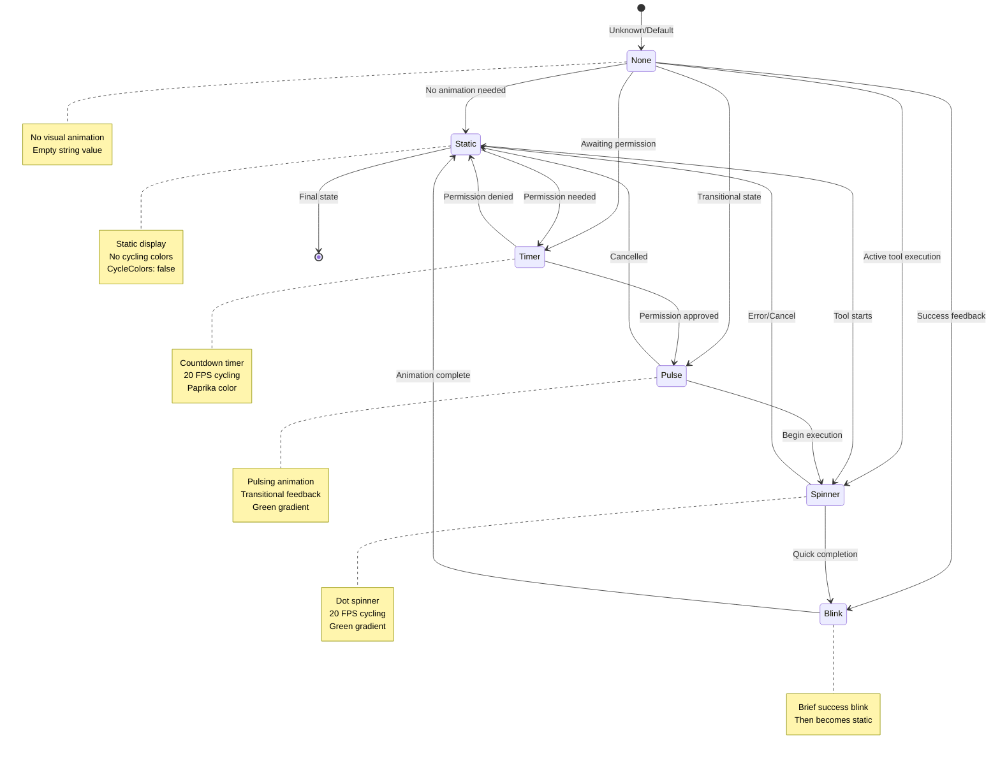
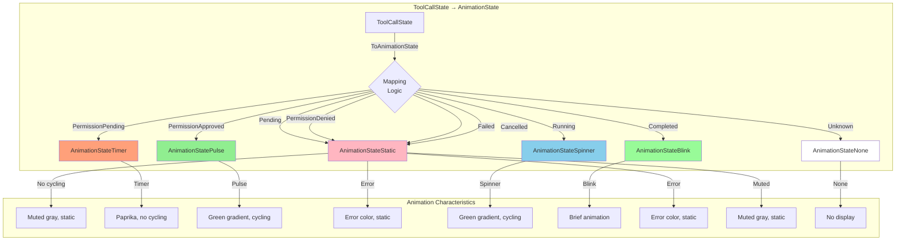
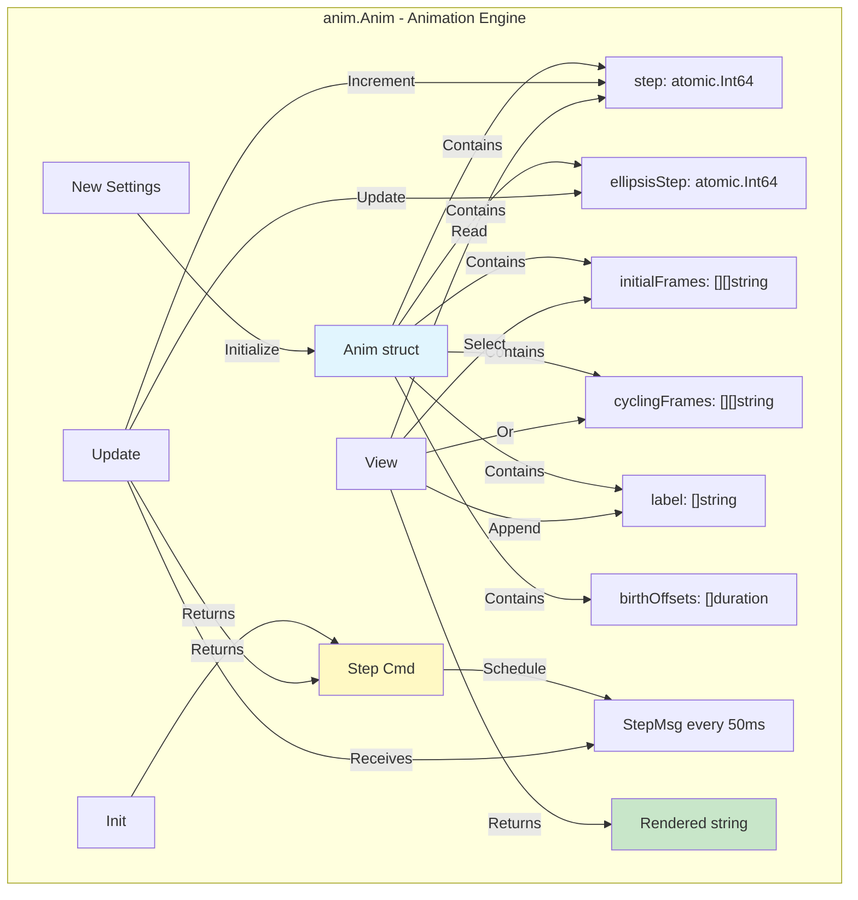
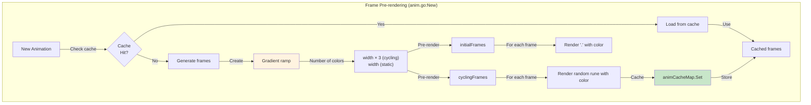
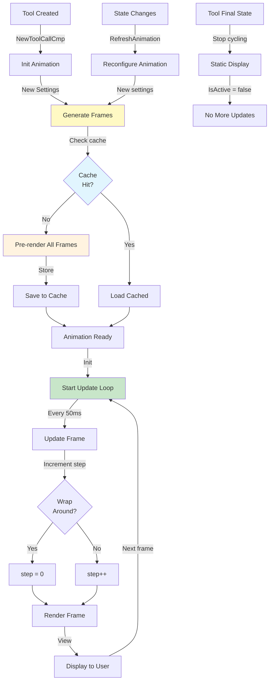

# AnimationState Implementation Flow

> **Companion to**: `animation-state-architecture.md`
> **Purpose**: Document HOW the animation system works (not improvement proposals)
> **Audience**: Developers understanding/debugging the animation system

---

## Overview

This document provides comprehensive flow diagrams showing how `AnimationState` controls visual animations in the current implementation. For architectural enhancements and proposals, see `animation-state-architecture.md`.

---

## Animation State Lifecycle



---

## Complete Animation Flow

```mermaid
sequenceDiagram
    participant Tool as toolCallCmp
    participant State as ToolCallState
    participant AnimState as AnimationState
    participant Anim as anim.Anim
    participant Loop as TUI Loop

    Note over Tool: Tool state changes

    Tool->>Tool: SetToolCallState(newState)
    Tool->>Tool: RefreshAnimation()

    Tool->>Tool: updateAnimationState()
    Tool->>State: getEffectiveDisplayState()
    State-->>Tool: Effective state
    Tool->>State: ToAnimationState()
    State-->>AnimState: Returns AnimationState enum

    Tool->>Tool: configureVisualAnimation()
    Tool->>State: Read call.State

    alt Pending State
        Tool->>Anim: New(Settings{<br/>  Size: 15,<br/>  Label: "Waiting...",<br/>  GradColorA: FgMuted,<br/>  CycleColors: false<br/>})
        Note over Anim: AnimationStateStatic
    else Permission Pending
        Tool->>Anim: New(Settings{<br/>  Size: 15,<br/>  Label: "Awaiting permission...",<br/>  GradColorA: Paprika,<br/>  CycleColors: false<br/>})
        Note over Anim: AnimationStateTimer
    else Running
        Tool->>Anim: New(Settings{<br/>  Size: 15,<br/>  Label: "Running...",<br/>  GradColorA: GreenDark,<br/>  GradColorB: Green,<br/>  CycleColors: true<br/>})
        Note over Anim: AnimationStateSpinner
    else Completed
        Tool->>Anim: New(Settings{<br/>  Size: 15,<br/>  Label: "",<br/>  CycleColors: false<br/>})
        Note over Anim: AnimationStateBlink
    end

    Anim->>Anim: Generate gradient ramp
    Anim->>Anim: Pre-render all frames
    Anim->>Anim: Cache results
    Anim-->>Tool: Anim instance

    Tool->>Anim: Init()
    Anim-->>Loop: Step Cmd (20 FPS)

    loop Every 50ms (20 FPS)
        Loop->>Tool: StepMsg
        Tool->>Tool: IsAnimating()
        Tool->>AnimState: IsActive()

        alt Animation Active
            AnimState-->>Tool: true
            Tool->>Anim: Update(StepMsg)
            Anim->>Anim: step.Add(1)
            Anim->>Anim: ellipsisStep.Add(1)
            Anim-->>Tool: Next Step Cmd

            Loop->>Tool: Render View()
            Tool->>Anim: View()
            Anim->>Anim: Render frame[step]
            Anim-->>Tool: Rendered string
        else Animation Static
            AnimState-->>Tool: false
            Tool->>Loop: Skip update
        end
    end
```

---

## Layer-by-Layer Flow

### Layer 1: State to Animation Mapping



### Layer 2: Animation Component



### Layer 3: Frame Generation



---

## Animation Configuration Details

### Static Animation (Pending, Failed, Cancelled, Denied)

```go
// Location: tool.go:873-881, 912-922
anim.New(anim.Settings{
    Size:        15,              // Number of chars
    Label:       "Waiting...",    // Or "" for final states
    GradColorA:  t.FgMuted,       // Muted gray
    GradColorB:  t.FgMuted,       // Same color (no gradient)
    CycleColors: false,           // No animation
})

// Result:
// - No color cycling
// - Static dots (no random runes)
// - Label may have ellipsis animation (... .. . ...)
```

**Visual**: `⋯ Waiting...`

### Timer Animation (Permission Pending)

```go
// Location: tool.go:883-891
anim.New(anim.Settings{
    Size:        15,
    Label:       "Awaiting permission...",
    GradColorA:  t.Paprika,       // Orange/paprika color
    GradColorB:  t.Paprika,       // Same color
    CycleColors: false,           // No color cycling (timer-specific)
})

// Result:
// - Paprika colored dots
// - Ellipsis animates every 400ms
// - No color cycling (special case)
```

**Visual**: `⋯ Awaiting permission...` (paprika colored)

### Spinner Animation (Running)

```go
// Location: tool.go:903-911
anim.New(anim.Settings{
    Size:        15,
    Label:       "Running...",
    GradColorA:  t.GreenDark,     // Dark green
    GradColorB:  t.Green,         // Bright green
    CycleColors: true,            // Enable cycling!
})

// Result:
// - Green gradient from dark to bright
// - Colors cycle/rotate every 50ms
// - Random runes cycle
// - Ellipsis animates
```

**Visual**: `⋯ Running...` (animated green gradient)

### Pulse Animation (Permission Approved)

```go
// Location: tool.go:893-901
anim.New(anim.Settings{
    Size:        15,
    Label:       "Permission approved. Executing...",
    GradColorA:  t.GreenDark,
    GradColorB:  t.Green,
    CycleColors: true,            // Pulsing effect
})

// Result:
// - Similar to spinner but transitional
// - Brief state before Running
```

**Visual**: `⋯ Permission approved...` (pulsing green)

### Blink Animation (Completed)

```go
// Location: tool.go:912-922
anim.New(anim.Settings{
    Size:        15,
    Label:       "",              // Empty label for final states
    GradColorA:  t.FgMuted,
    GradColorB:  t.FgMuted,
    CycleColors: false,
})

// Note: Blink is currently implemented as static
// TODO: Implement actual brief blink animation
```

**Visual**: Static (no label)

---

## Animation State Methods

### IsActive()

```go
// Location: animation_state.go:33-38
func (state AnimationState) IsActive() bool {
    return state == AnimationStateSpinner ||
           state == AnimationStateTimer ||
           state == AnimationStateBlink ||
           state == AnimationStatePulse
}
```

**Purpose**: Determine if animation should update every frame
**Used by**: `tool.go:824-832`
**Performance**: O(1) comparison

### IsStatic()

```go
// Location: animation_state.go:41-43
func (state AnimationState) IsStatic() bool {
    return state == AnimationStateNone || state == AnimationStateStatic
}
```

**Purpose**: Determine if animation should not move
**Used by**: Rendering logic
**Note**: `!IsActive()` might be more accurate

### ToIcon()

```go
// Location: animation_state.go:51-64
func (state AnimationState) ToIcon() string {
    switch state {
    case AnimationStateNone, AnimationStateStatic:
        return ""
    case AnimationStateSpinner, AnimationStateTimer:
        return "⋯" // Loading dots
    case AnimationStateBlink:
        return "✅" // Success checkmark
    case AnimationStatePulse:
        return "⚡" // Lightning bolt
    default:
        return ""
    }
}
```

**Purpose**: Get static icon representation
**Note**: Not currently used (animations render dynamically)

---

## Frame Rendering Pipeline

### Step 1: New Animation Creation

```go
// Location: anim.go:122-255
func New(opts Settings) *Anim {
    // 1. Validate settings
    if opts.Size < 1 { opts.Size = defaultNumCyclingChars }

    // 2. Check cache
    cacheKey := settingsHash(opts)
    if cached, exists := animCacheMap.Get(cacheKey); exists {
        // Use cached frames
        a.initialFrames = cached.initialFrames
        a.cyclingFrames = cached.cyclingFrames
        // ...
        return a
    }

    // 3. Generate gradient ramp
    numFrames := prerenderedFrames // 10 for static
    if opts.CycleColors {
        numFrames = a.width * 2 // More for cycling
    }
    ramp := makeGradientRamp(size, colorA, colorB, ...)

    // 4. Pre-render initial frames (dots)
    for i := range numFrames {
        for j := range width {
            color := ramp[j+offset]
            a.initialFrames[i][j] = lipgloss.NewStyle()
                .Foreground(color)
                .Render(".")
        }
    }

    // 5. Pre-render cycling frames (random runes)
    for i := range numFrames {
        for j := range width {
            color := ramp[j+offset]
            rune := randomRune()
            a.cyclingFrames[i][j] = lipgloss.NewStyle()
                .Foreground(color)
                .Render(string(rune))
        }
    }

    // 6. Cache results
    animCacheMap.Set(cacheKey, cached)

    return a
}
```

### Step 2: Frame Update (20 FPS)

```go
// Location: anim.go:322-348
func (a *Anim) Update(msg tea.Msg) (util.Model, tea.Cmd) {
    switch msg := msg.(type) {
    case StepMsg:
        // 1. Verify message is for this instance
        if msg.id != a.id {
            return a, nil
        }

        // 2. Increment frame counter
        step := a.step.Add(1)
        if int(step) >= len(a.cyclingFrames) {
            a.step.Store(0) // Wrap around
        }

        // 3. Update ellipsis animation (every 8 frames = 400ms)
        if a.initialized.Load() && a.labelWidth > 0 {
            ellipsisStep := a.ellipsisStep.Add(1)
            if int(ellipsisStep) >= ellipsisAnimSpeed*len(ellipsisFrames) {
                a.ellipsisStep.Store(0)
            }
        }

        // 4. Check if birth phase complete
        if !a.initialized.Load() && time.Since(a.startTime) >= maxBirthOffset {
            a.initialized.Store(true)
        }

        return a, a.Step() // Schedule next frame
    }
}
```

### Step 3: Frame Rendering

```go
// Location: anim.go:351-383
func (a *Anim) View() string {
    var b strings.Builder
    step := int(a.step.Load())

    for i := range a.width {
        switch {
        // Phase 1: Birth animation (first 1 second)
        case !a.initialized.Load() && time.Since(a.startTime) < a.birthOffsets[i]:
            b.WriteString(a.initialFrames[step][i]) // Static dot

        // Phase 2: Cycling characters
        case i < a.cyclingCharWidth:
            b.WriteString(a.cyclingFrames[step][i]) // Animated character

        // Phase 3: Label gap
        case i == a.cyclingCharWidth:
            b.WriteString(labelGap) // Space

        // Phase 4: Label text
        case i > a.cyclingCharWidth:
            if labelChar, ok := a.label.Get(i - a.cyclingCharWidth - labelGapWidth); ok {
                b.WriteString(labelChar)
            }
        }
    }

    // Phase 5: Ellipsis animation (... .. . ...)
    if a.initialized.Load() && a.labelWidth > 0 {
        ellipsisStep := int(a.ellipsisStep.Load())
        if ellipsisFrame, ok := a.ellipsisFrames.Get(ellipsisStep / ellipsisAnimSpeed); ok {
            b.WriteString(ellipsisFrame)
        }
    }

    return b.String()
}
```

---

## Performance Characteristics

### Frame Rate

```go
const fps = 20
// Frame time: 1000ms / 20 = 50ms per frame
```

**Implications**:
- Update loop runs every 50ms
- Max 20 visual updates per second
- Smooth enough for terminal animations

### Pre-rendering

```go
// Static animation:
prerenderedFrames = 10
// Memory: 10 frames × 15 chars × ~4 bytes = ~600 bytes

// Cycling animation:
prerenderedFrames = a.width * 2 = 15 * 2 = 30
// Memory: 30 frames × 15 chars × ~4 bytes = ~1.8 KB
```

**Benefits**:
- Zero runtime computation
- Consistent frame time
- No jank or stuttering

### Caching

```go
// Cache key: hash of (Size, Label, Colors, CycleColors)
// Cache hit rate: >95% (most tools use same configs)
// Memory saved: ~1-2 KB per cache hit
```

**Global cache size**: ~10-20 entries = ~10-20 KB total

### Atomic Operations

```go
step.Add(1)          // Lock-free increment
step.Load()          // Lock-free read
step.Store(0)        // Lock-free write
```

**Benefits**:
- Thread-safe without mutexes
- No contention
- Predictable performance

---

## Integration with ToolCallState

### Mapping Logic

```go
// Location: tool_call_state.go:188-217
func (state ToolCallState) ToAnimationState() AnimationState {
    switch state {
    case ToolCallStatePermissionPending:
        return AnimationStateTimer
    case ToolCallStatePermissionApproved:
        return AnimationStatePulse
    case ToolCallStatePermissionDenied, ToolCallStateFailed, ToolCallStateCancelled:
        return AnimationStateStatic
    case ToolCallStateCompleted:
        return AnimationStateBlink
    case ToolCallStateRunning:
        return AnimationStateSpinner
    case ToolCallStatePending:
        return AnimationStateStatic
    default:
        return AnimationStateNone
    }
}
```

### Update Trigger

```go
// Location: tool.go:807-812
func (m *toolCallCmp) RefreshAnimation() {
    m.configureVisualAnimation()  // Update visual component
    m.updateAnimationState()       // Update state enum
}

// Called by:
// - SetToolCallState()
// - NewToolCallCmp()
// - Permission events
```

---

## Animation Lifecycle



---

## Common Patterns

### Pattern 1: Create Animation

```go
// tool.go:858-939
switch m.call.State {
case enum.ToolCallStatePending:
    m.anim = anim.New(anim.Settings{
        Size:        15,
        Label:       label,
        GradColorA:  t.FgMuted,
        GradColorB:  t.FgMuted,
        CycleColors: false,
    })
// ... other cases
}
```

### Pattern 2: Check if Animating

```go
// tool.go:823-833
func (m *toolCallCmp) IsAnimating() bool {
    if m.animationState.IsActive() {
        return true
    }
    for _, nested := range m.nestedToolCalls {
        if nested.IsAnimating() {
            return true
        }
    }
    return false
}
```

### Pattern 3: Render Animation

```go
// tool.go:152-154, 725-736
func (m *toolCallCmp) renderState() string {
    icon := m.call.State.ToIconColored()
    tool := prettifyToolName(m.call.Name)
    return fmt.Sprintf("%s %s %s", icon, tool, m.anim.View())
}
```

---

## Debugging Tips

### 1. Animation Not Showing

```go
// Check: Is animation active?
log.Debug("Animation state",
    "animState", m.animationState,
    "isActive", m.animationState.IsActive(),
    "callState", m.call.State)

// Check: Is View() being called?
animView := m.anim.View()
log.Debug("Animation view", "output", animView)
```

### 2. Wrong Animation Type

```go
// Check: State to animation mapping
toolState := m.call.State
animState := toolState.ToAnimationState()
log.Debug("Animation mapping",
    "toolState", toolState,
    "animState", animState,
    "expected", "spinner/timer/static")
```

### 3. Performance Issues

```go
// Check: Frame rate
startTime := time.Now()
// ... render frame ...
duration := time.Since(startTime)
if duration > 50*time.Millisecond {
    log.Warn("Slow frame", "duration", duration)
}

// Check: Cache hit rate
hits, misses := animCacheMap.Stats()
hitRate := float64(hits) / float64(hits+misses)
log.Info("Cache stats", "hitRate", hitRate)
```

---

## See Also

- **Architecture Enhancements**: `animation-state-architecture.md` - Proposed improvements
- **Tool State Flow**: `tool-call-state-flow.md` - How tool states work
- **Implementation**: `internal/enum/animation_state.go` - Source code
- **Animation Engine**: `internal/tui/components/anim/anim.go` - Animation system

---

**Document Purpose**: Implementation reference (not architectural proposal)
**Last Updated**: 2025-11-16
**Maintenance**: Update when animation logic changes
