# Current ToolCall Architecture Analysis

**📅 Date:** Tue Nov 18 11:28:41 CET 2025

## Current Event & Command Flow

```mermaid
graph TB
    %% CURRENT ARCHITECTURE - MUTEX-BASED EVENT FLOW
    
    %% EXTERNAL EVENT SOURCES
    ExternalTool[External Tool Process]
    User[User Input]
    TeaFramework[BubbleTea Framework]
    
    %% MESSAGE LAYER
    subgraph "Current Message Types"
        StreamMsg[StreamOutputMsg<br/>Real-time tool output]
        CompleteMsg[StreamCompleteMsg<br/>Tool execution finished]
        AnimMsg[anim.StepMsg<br/>Animation ticks]
        KeyMsg[tea.KeyPressMsg<br/>Keyboard input]
    end
    
    %% TOOL CALL COMPONENT
    subgraph "toolCallCmp"
        TC[ToolCall Component]
        
        subgraph "Shared Mutable State"
            StreamingContent["streamingContent[]<br/>Output lines buffer"]
            ToolResult[result<br/>Final execution result]
            StreamingFlag[showStreaming<br/>Streaming enabled flag]
            ToolState[call.State<br/>Current tool state]
        end
        
        subgraph "Mutex Protection"
            Lock[sync.RWMutex<br/>Thread safety locks]
            ReadLock["mu.RLock() blocks<br/>State access locks"]
            WriteLock["mu.Lock() blocks<br/>State mutation locks"]
        end
        
        subgraph "State Calculation"
            GetEffectiveState["getEffectiveDisplayState()<br/>Complex state derivation<br/>Potential race condition!"]
            CalcLogic["if result.isEmpty {<br/>  return call.State<br/>} else {<br/>  return result.getState()<br/>}"]
        end
        
        subgraph "Command Generation"
            CopyCmd["copyTool()<br/>Clipboard operations"]
            AnimCmd["RefreshAnimation()<br/>Animation state sync"]
            BatchCmd["tea.Batch()<br/>Command batching"]
        end
        
        subgraph "Rendering"
            Render["View() method<br/>UI generation"]
            Update["Update() method<br/>Event handling"]
        end
    end
    
    %% FLOW RELATIONSHIPS
    ExternalTool -->|writes output| StreamMsg
    ExternalTool -->|execution complete| CompleteMsg
    User --> KeyMsg
    TeaFramework --> AnimMsg
    
    StreamMsg --> Update
    CompleteMsg --> Update
    AnimMsg --> Update
    KeyMsg --> Update
    
    Update -->|lock acquisition| WriteLock
    Update -->|state mutation| StreamingContent
    Update -->|state mutation| ToolResult
    Update -->|state mutation| StreamingFlag
    Update -->|state mutation| ToolState
    
    Render -->|lock acquisition| ReadLock
    Render -->|state access| StreamingContent
    Render -->|state access| ToolResult
    Render -->|state access| StreamingFlag
    Render -->|state access| ToolState
    Render -->|complex calculation| GetEffectiveState
    
    GetEffectiveState -->|reads both| ToolResult
    GetEffectiveState -->|reads both| ToolState
    GetEffectiveState -->|race condition!| CalcLogic
    
    Update -->|command generation| CopyCmd
    Update -->|command generation| AnimCmd
    Update -->|command generation| BatchCmd
    
    Render -->|UI output| TC
    
    %% CRITICAL ISSUES HIGHLIGHTED
    classDef critical fill:#ff9999,stroke:#ff0000,stroke-width:3px
    classDef warning fill:#ffff99,stroke:#ff9900,stroke-width:2px
    classDef safe fill:#99ff99,stroke:#009900,stroke-width:2px
    
    class GetEffectiveState,CalcLogic critical
    class StreamingContent,ToolResult,StreamingFlag,ToolState warning
    class StreamMsg,CompleteMsg,AnimMsg,KeyMsg safe
```

## Critical Issues Identified

### 🚨 **Race Conditions**
- `getEffectiveDisplayState()` reads `result.ToolCallID.IsEmpty()` and `result.GetResultState()` non-atomically
- Streaming updates can occur while state calculation is in progress
- No atomic consistency guarantees

### 🔴 **Performance Bottlenecks**
- `sync.RWMutex` serializes all state access
- High contention during streaming output
- Lock/unlock overhead on every message

### 🔴 **Complexity Issues**
- Multiple lock acquisition points
- Deadlock potential with nested tool calls
- Hard-to-reason-about state transitions

## Current Message Types

| Message | Purpose | Issues |
|---------|---------|---------|
| `StreamOutputMsg` | Real-time output | Mutex protected, high contention |
| `StreamCompleteMsg` | Completion notification | Complex state mutation |
| `anim.StepMsg` | Animation updates | Nested lock acquisition |
| `tea.KeyPressMsg` | User input | No issues |

## Current Commands

| Command | Purpose | Issues |
|---------|---------|---------|
| `copyTool()` | Clipboard operations | Requires lock acquisition |
| `RefreshAnimation()` | Animation sync | Complex state recalculation |
| `tea.Batch()` | Command batching | No issues |

## Conclusion

The current architecture works but has significant limitations:
1. **Thread safety is complex** - multiple lock points
2. **Performance is limited** - mutex contention
3. **State is mutable** - hard to reason about
4. **Streaming is bolted on** - not native

**Need: Event-driven, lock-free architecture**