# Improved ToolCall Architecture - Event-Driven Design

**📅 Date:** Tue Nov 18 11:28:41 CET 2025

## Ideal Event-Driven & Command Flow

```mermaid
graph TB
    %% IMPROVED ARCHITECTURE - LOCK-FREE EVENT FLOW
    
    %% EXTERNAL EVENT SOURCES
    ExternalTool[External Tool Process]
    User[User Input]
    TeaFramework[BubbleTea Framework]
    
    %% IMMUTABLE EVENT MESSAGES
    subgraph "Lock-Free Message Types"
        StreamEvent[ToolCallStreamMsg<br/>Immutable output chunk<br/>No shared state]
        StateChangeEvent[ToolCallStateChangeMsg<br/>Atomic state transition<br/>Old+New states]
        CompleteEvent[ToolCallCompleteMsg<br/>Final result immutable<br/>Duration tracking]
        ErrorEvent[ToolCallErrorMsg<br/>Error propagation<br/>Stack trace included]
    end
    
    %% IMMUTABLE STATE SNAPSHOTS
    subgraph "State Snapshots (Immutable)"
        StateSnapshot1[Snapshot 1<br/>State at time T1]
        StateSnapshot2[Snapshot 2<br/>State at time T2]
        StateSnapshot3[Snapshot 3<br/>State at time T3]
        SnapshotHistory[Snapshot History<br/>Immutable timeline]
    end
    
    %% EVENT-DRIVEN UPDATE LOGIC
    subgraph "Lock-Free Update Logic"
        UpdateMethod["Update() method<br/>Pure function<br/>No side effects"]
        NewState[New State Calculation<br/>Immutable copy creation<br/>Deterministic]
        EventReducer["Event Reducer Pattern<br/>Event → NewState<br/>Pure transformation"]
        StateTransition[Atomic State Transition<br/>Swap pointer<br/>Lock-free]
    end
    
    %% EVENT SOURCES TO MESSAGES
    ExternalTool -->|output chunk| StreamEvent
    ExternalTool -->|execution complete| CompleteEvent
    ExternalTool -->|execution error| ErrorEvent
    User -->|keyboard input| TeaFramework
    TeaFramework -->|animation tick| User
    TeaFramework -->|key press| ExternalTool
    
    %% EVENT PROCESSING PIPELINE
    StreamEvent --> UpdateMethod
    StateChangeEvent --> UpdateMethod
    CompleteEvent --> UpdateMethod
    ErrorEvent --> UpdateMethod
    TeaFramework --> UpdateMethod
    
    %% IMMUTABLE STATE TRANSFORMATIONS
    UpdateMethod -->|pure function| EventReducer
    EventReducer -->|deterministic| NewState
    NewState -->|atomic pointer swap| StateTransition
    StateTransition -->|append to history| SnapshotHistory
    SnapshotHistory -->|creates| StateSnapshot1
    SnapshotHistory -->|creates| StateSnapshot2
    SnapshotHistory -->|creates| StateSnapshot3
    
    %% LOCK-FREE RENDERING
    subgraph "Lock-Free Rendering"
        ViewMethod["View() method<br/>Pure function<br/>State → UI"]
        StateReader[Atomic state read<br/>Single pointer load<br/>Consistent snapshot]
        RenderCache[Render cache<br/>Memoization<br/>Performance optimization]
    end
    
    SnapshotHistory -->|consistent read| StateReader
    StateReader -->|single snapshot| ViewMethod
    ViewMethod -->|cached result| RenderCache
    RenderCache -->|UI output| UI[User Interface]
    
    %% COMMAND GENERATION (SIDE EFFECTS ONLY)
    subgraph "Pure Command Generation"
        CopyCmd[Copy Command<br/>Clipboard operation<br/>Side effect only]
        ToolExecCmd[Tool Execution Command<br/>External process start<br/>Side effect only]
        NotificationCmd[Notification Command<br/>User alert<br/>Side effect only]
    end
    
    ViewMethod -->|user action| CopyCmd
    StateSnapshot1 -->|auto-retry| ToolExecCmd
    ErrorEvent -->|error handling| NotificationCmd
    
    %% PERFORMANCE BENEFITS
    subgraph "Performance Characteristics"
        NoLocks["🚀 NO LOCKS<br/>Zero contention<br/>Linear scaling"]
        ImmutableState["🛡️ IMMUTABLE STATE<br/>No races<br/>Predictable behavior"]
        Deterministic["📊 DETERMINISTIC<br/>Easy to test<br/>Event sourcing"]
        Cacheable["💾 CACHEABLE<br/>Render memoization<br/>Performance optimization"]
    end
    
    %% BUBBLETEA INTEGRATION
    subgraph "BubbleTea Integration"
        TeaUpdate[tea.Update<br/>Event handling]
        TeaView[tea.View<br/>UI rendering]
        TeaCmd[tea.Cmd<br/>Side effects]
        TeaBatch[tea.Batch<br/>Command batching]
    end
    
    UpdateMethod --> TeaUpdate
    ViewMethod --> TeaView
    CopyCmd --> TeaCmd
    ToolExecCmd --> TeaCmd
    NotificationCmd --> TeaCmd
    TeaCmd --> TeaBatch
    TeaBatch --> TeaFramework
    
    %% STYLE DEFINITIONS
    classDef critical fill:#ffcccc,stroke:#ff0000,stroke-width:2px
    classDef improved fill:#ccffcc,stroke:#00ff00,stroke-width:2px
    classDef performance fill:#ccccff,stroke:#0000ff,stroke-width:2px
    classDef framework fill:#ffccff,stroke:#ff00ff,stroke-width:2px
    
    class StreamEvent,StateChangeEvent,CompleteEvent,ErrorEvent improved
    class StateSnapshot1,StateSnapshot2,StateSnapshot3,SnapshotHistory improved
    class UpdateMethod,EventReducer,NewState,StateTransition improved
    class ViewMethod,StateReader,RenderCache performance
    class NoLocks,ImmutableState,Deterministic,Cacheable performance
    class TeaUpdate,TeaView,TeaCmd,TeaBatch,TeaFramework framework
```

## Architecture Benefits

### 🚀 **Performance Improvements**
- **Zero Lock Contention** - No mutexes, no waiting
- **Linear Scalability** - Perfect concurrency support
- **Cache Friendliness** - Immutable state enables memoization
- **Memory Efficiency** - Shared data via snapshots

### 🛡️ **Safety Improvements**
- **No Race Conditions** - Immutable state eliminates races
- **Deterministic Behavior** - Pure functions are predictable
- **Event Sourcing** - Full audit trail of state changes
- **Isolation** - Components can't corrupt each other

### 🧪 **Testing Improvements**
- **Pure Functions** - Easy to unit test
- **Deterministic** - Same input always produces same output
- **Event Replay** - Can replay any sequence of events
- **Snapshot Testing** - Can test specific state snapshots

## Key Design Patterns

### 1. **Event Sourcing Pattern**
- All state changes are events
- Full history of changes
- Can replay events to rebuild state

### 2. **Immutable State Pattern**
- State never mutates in place
- Always create new state snapshots
- Old state becomes garbage-collected

### 3. **Reducer Pattern**
- Pure function: `(State, Event) → NewState`
- No side effects
- Deterministic and testable

### 4. **Pointer Swap Pattern**
- Atomic pointer swap for state updates
- Readers see consistent snapshot
- No blocking for writers

## Message Flow

### **Streaming Flow:**
1. External tool emits `ToolCallStreamMsg`
2. Update() processes event immutably
3. New state snapshot created with accumulated output
4. Pointer swap updates current state atomically
5. View() renders new state without locks

### **State Change Flow:**
1. `ToolCallStateChangeMsg` received
2. Reducer applies transition rules
3. New state snapshot created
4. Old state archived in history
5. Atomic pointer swap updates current state

### **Completion Flow:**
1. External tool emits `ToolCallCompleteMsg`
2. Final result incorporated into state
3. Streaming buffer cleared
4. Final state snapshot created
5. Completion commands generated

## Comparison with Current Architecture

| Aspect | Current | Improved |
|--------|---------|----------|
| **Locks** | `sync.RWMutex` everywhere | **No locks** |
| **State** | Shared mutable | **Immutable snapshots** |
| **Concurrency** | Serialized access | **Perfect concurrency** |
| **Performance** | Limited by contention | **Linear scaling** |
| **Testing** | Complex, race-prone | **Pure, deterministic** |
| **Debugging** | Hard to reason about | **Event timeline** |
| **Memory** | High allocation overhead | **Efficient sharing** |

## Implementation Strategy

### **Phase 1: Event Infrastructure**
- Define immutable event types
- Add event processing to Update()
- Maintain backward compatibility

### **Phase 2: State Immutability**
- Replace mutable fields with immutable snapshots
- Add atomic pointer swap
- Update all state access methods

### **Phase 3: Lock Elimination**
- Remove all mutex usage
- Optimize for lock-free access
- Add performance monitoring

### **Phase 4: Optimization**
- Add render caching
- Implement event batching
- Optimize memory usage

## Conclusion

The improved architecture eliminates the core issues:
- **No race conditions** through immutability
- **No performance bottlenecks** through lock-free design
- **No complexity** through pure functions
- **Perfect streaming** through event-driven approach

**This is the correct, production-ready architecture!**