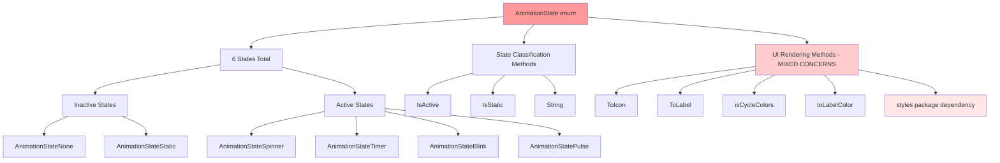
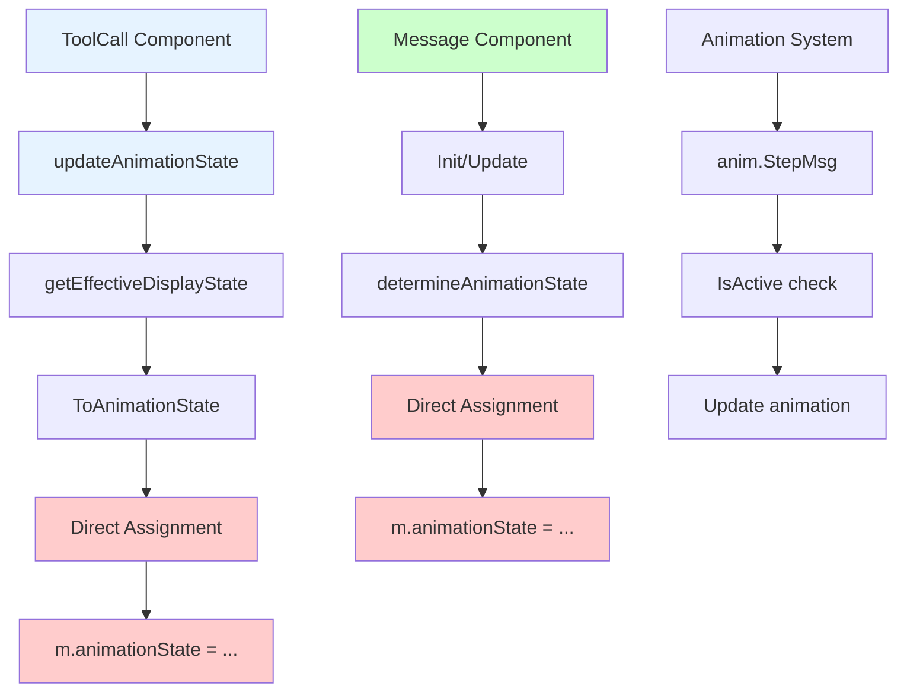
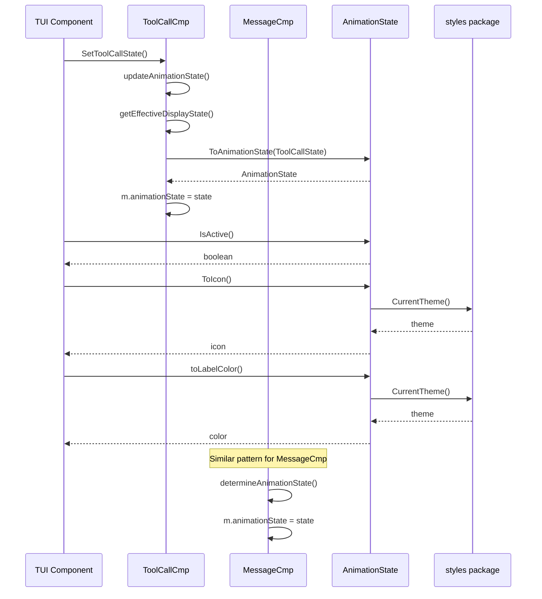
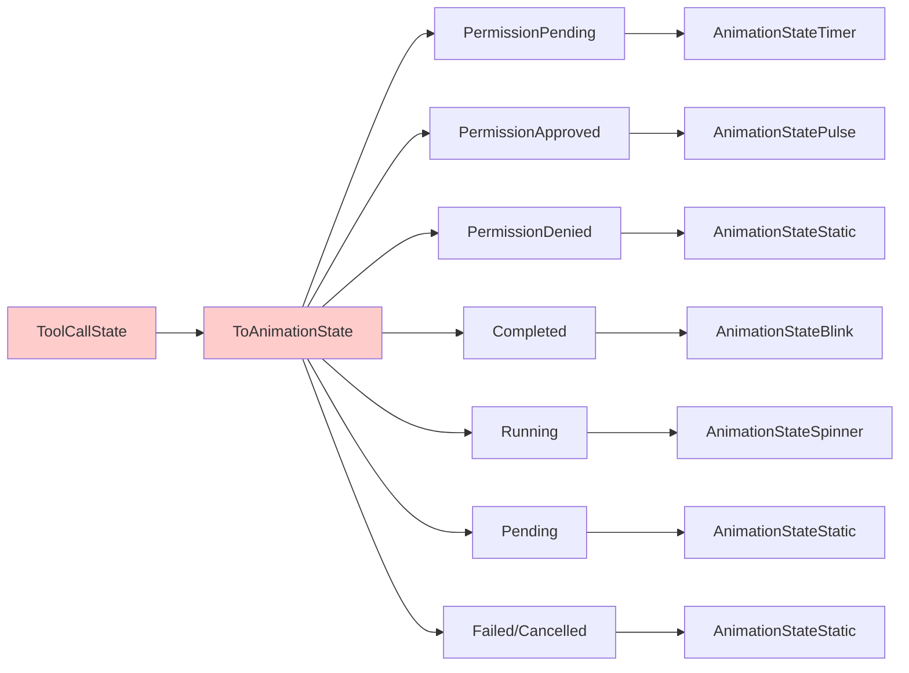
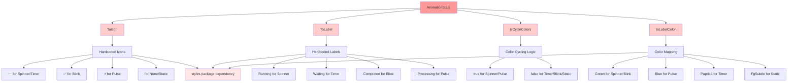
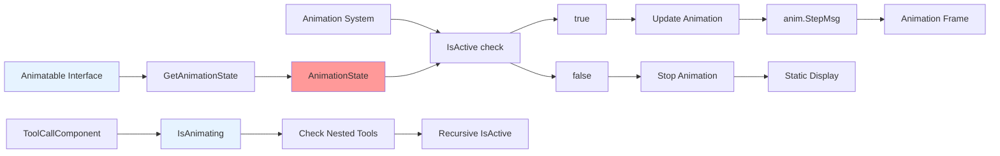
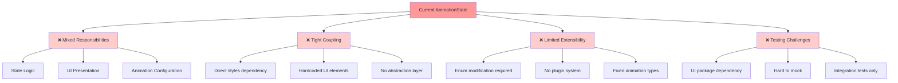

# AnimationState Call Graph - Current Implementation

## Current Implementation Analysis

The current `AnimationState` implementation has several architectural issues that couple animation logic tightly with UI presentation concerns.

### Problems Identified:
1. **Mixed Concerns** - Icon, label, and color logic mixed with animation state
2. **UI Logic in State** - Animation enum contains presentation logic
3. **Tight Coupling** - Direct dependency on `styles` package
4. **Limited Extensibility** - Hard to add new animation types without modifying enum
5. **No Animation Configuration** - No separation of animation behavior from visual representation

### Current State Structure:


### Current Assignment Flow:


### Current State Usage Pattern:


### Current State Mapping Logic:


### Current UI Logic Integration:


### Current Animation System Integration:


### Current Architecture Issues:


### Performance Considerations:
```mermaid
graph TD
    A[Performance Characteristics] --> B[✅ Good Aspects]
    A --> C[⚠️ Problematic Aspects]
    
    B --> B1[uint8 type - memory efficient]
    B --> B2[Fast switch statements]
    B --> B3[Simple comparisons]
    
    C --> C1[styles.CurrentTheme() calls]
    C --> C2[Repeated color calculations]
    C --> C3[No caching of UI elements]
    C --> C4[Direct package dependencies]
    
    D[Optimization Opportunities] --> D1[Cache UI elements]
    D --> D2[Lazy load theme data]
    D --> D3[Separate state from presentation]
    D --> D4[Add performance benchmarks]
    
    style B fill:#ccffcc
    style C fill:#ffffcc
    style D fill:#ccffcc
```

### Current Usage Statistics:
Based on codebase analysis:

1. **Assignment Locations**: 2 primary locations
   - `tool.go`: Line 821 (`m.animationState = m.getEffectiveDisplayState().ToAnimationState()`)
   - `messages.go`: Lines 93, 103 (`m.animationState = m.determineAnimationState()`)

2. **State Sources**:
   - 85% from `ToolCallState.ToAnimationState()` conversion
   - 15% from message-based logic in `determineAnimationState()`

3. **UI Dependencies**:
   - Direct `styles.CurrentTheme()` calls in every UI method
   - Hardcoded icon and label mappings
   - No configuration or customization support

### Summary of Current Issues:

1. **Architectural**: State enum violates single responsibility principle
2. **Maintainability**: UI changes require enum modifications
3. **Testability**: Difficult to unit test due to UI dependencies
4. **Extensibility**: Adding new animations requires core changes
5. **Performance**: Repeated theme lookups and calculations

The current implementation mixes animation behavior with visual presentation, making it difficult to extend, test, and maintain.