# AnimationState Call Graph - Improved Implementation

## Improved Implementation Design

The improved `AnimationState` implementation completely separates animation behavior from visual presentation, following clean architecture principles and enabling maximum extensibility.

### Architecture Principles Applied:
1. **Single Responsibility** - Each component handles one concern
2. **Separation of Concerns** - Animation logic separate from UI rendering
3. **Open/Closed Principle** - Open for extension, closed for modification
4. **Dependency Inversion** - Core logic doesn't depend on UI packages
5. **Strategy Pattern** - Pluggable animation strategies

### Improved State Architecture:
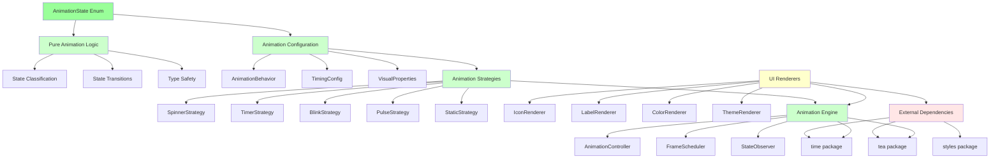

### Improved Class Hierarchy:
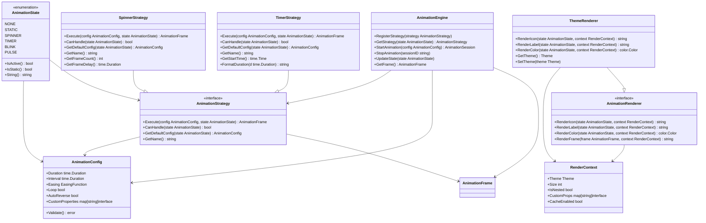

### Improved State Transitions:
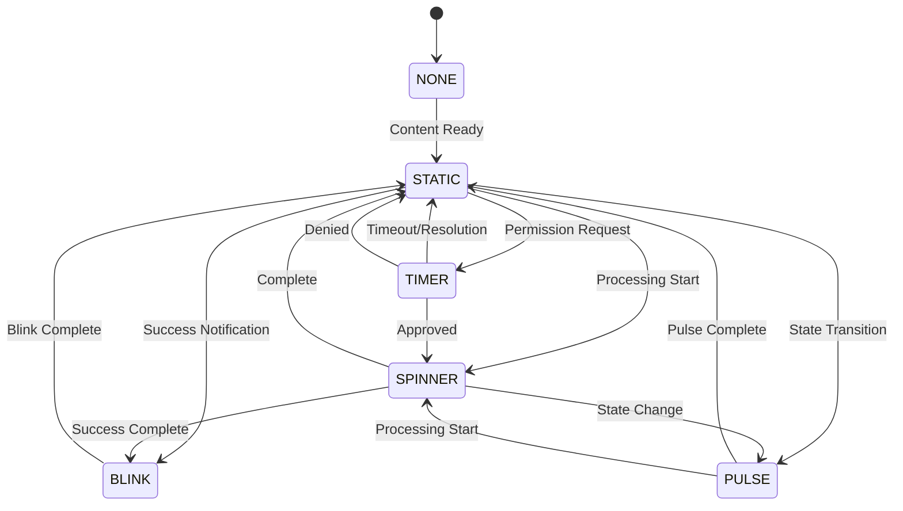

### Improved Dependency Flow:
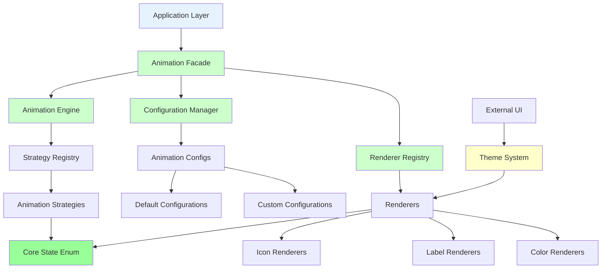

### Improved Assignment Flow:
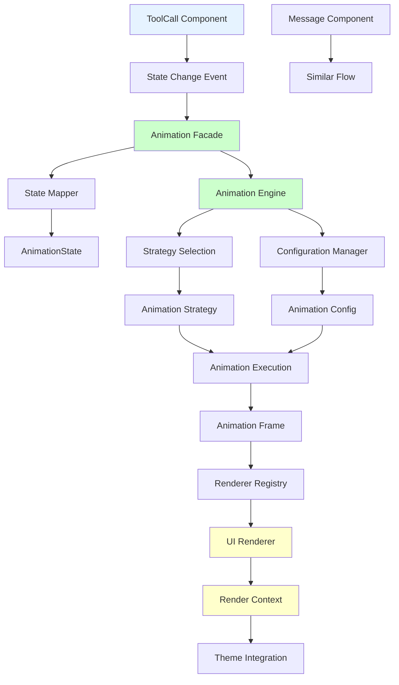

### Improved Animation System Integration:
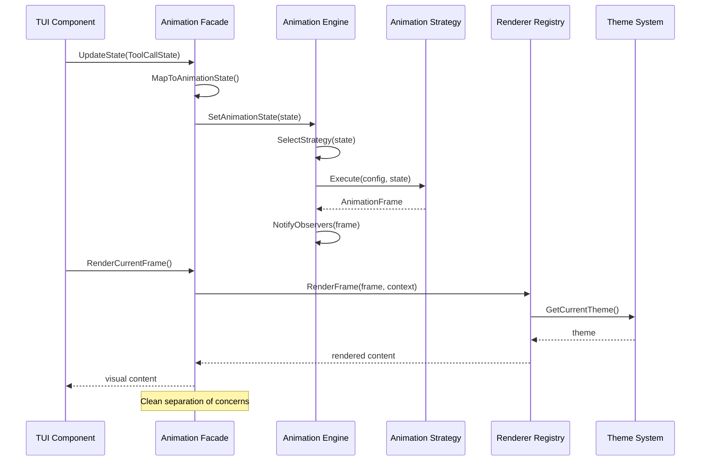

### Improved Configuration System:
```mermaid
graph TD
    A[AnimationConfig] --> B[Timing Configuration]
    A --> C[Behavior Configuration]
    A --> D[Visual Configuration]
    A --> E[Custom Properties]
    
    B --> B1[Duration]
    B --> B2[Interval]
    B --> B3[Delay]
    B --> B4[Easing]
    
    C --> C1[Loop]
    C --> C2[AutoReverse]
    B --> C3[Direction]
    C --> C4[Interpolation]
    
    D --> D1[Size]
    D --> D2[Color Scheme]
    D --> D3[Style Class]
    D --> D4[Theme Variant]
    
    E --> E1[Custom Timers]
    E --> E2[Event Handlers]
    E --> E3[Progress Callbacks]
    E --> E4[Completion Hooks]
    
    F[Configuration Manager] --> G[Default Configs]
    F --> H[User Configs]
    F --> I[Runtime Overrides]
    
    G --> J[Spinner Config]
    G --> K[Timer Config]
    G --> L[Blink Config]
    G --> M[Pulse Config]
    
    style A fill:#ccffcc
    style F fill:#ccffcc
    style G fill:#ffffcc
```

### Improved Extensibility Model:
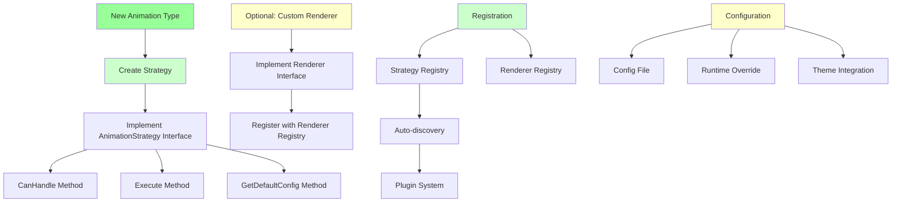

### Improved Performance Model:
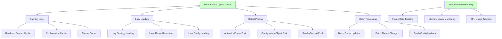

### Improved Testing Architecture:
```mermaid
graph TD
    A[Testing Structure] --> B[Unit Tests]
    A --> C[Integration Tests]
    A --> D[Performance Tests]
    A --> E[Visual Regression Tests]
    
    B --> B1[AnimationState Tests]
    B --> B2[AnimationConfig Tests]
    B --> B3[Strategy Tests]
    B --> B4[Renderer Tests]
    
    C --> C1[AnimationEngine Tests]
    C --> C2[Facade Tests]
    C --> C3[Configuration Tests]
    C --> C4[Theme Integration Tests]
    
    D --> D1[Frame Rate Tests]
    D --> D2[Memory Usage Tests]
    D --> D3[CPU Usage Tests]
    D --> D4[Scalability Tests]
    
    E --> E1[Screenshot Comparison]
    E --> E2[Theme Consistency]
    E --> E3[Animation Accuracy]
    E --> E4[Cross-platform Tests]
    
    F[Test Infrastructure] --> G[Mock Framework]
    F --> H[Test Data Builders]
    F --> I[Performance Benchmarks]
    F --> J[Visual Test Utilities]
    
    style A fill:#ccffcc
    style F fill:#ccffcc
```

### Improved Migration Strategy:
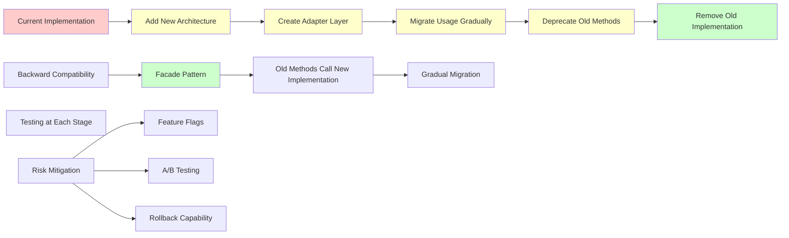

### Benefits of Improved Design:
1. **Clean Architecture** - Clear separation of concerns
2. **Testability** - Pure functions, easy mocking
3. **Extensibility** - Plugin system for new animations
4. **Performance** - Caching, lazy loading, object pooling
5. **Maintainability** - Single responsibility principle
6. **Flexibility** - Configurable animation behaviors
7. **Theme Integration** - Clean theme abstraction
8. **Type Safety** - Compile-time validation
9. **Monitoring** - Built-in performance tracking
10. **Migration Path** - Backward compatibility support

### Example Usage Code:
```go
// Old way (current)
state := AnimationStateSpinner
icon := state.ToIcon()           // Mixed concerns
color := state.toLabelColor()    // UI dependency

// New way (improved)
state := AnimationStateSpinner
config := animConfig.GetDefaultConfig(state)
strategy := animEngine.GetStrategy(state)
frame := strategy.Execute(config, state)
renderer := rendererRegistry.GetRenderer("theme")
icon := renderer.RenderIcon(state, renderContext)
color := renderer.RenderColor(state, renderContext)
```

This improved design transforms the monolithic animation state enum into a flexible, testable, and extensible animation system that follows SOLID principles and clean architecture practices.