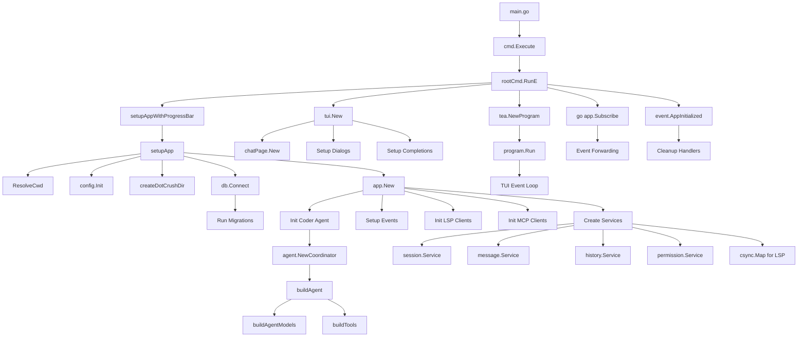
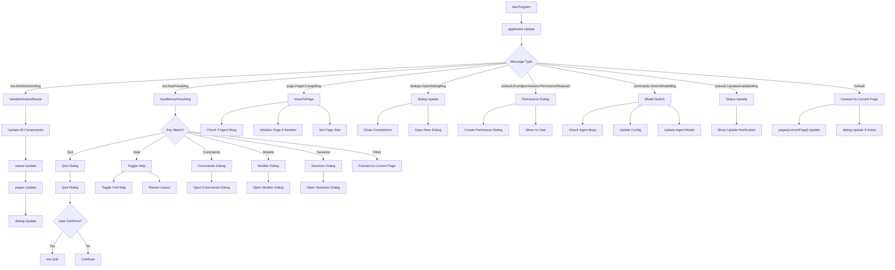
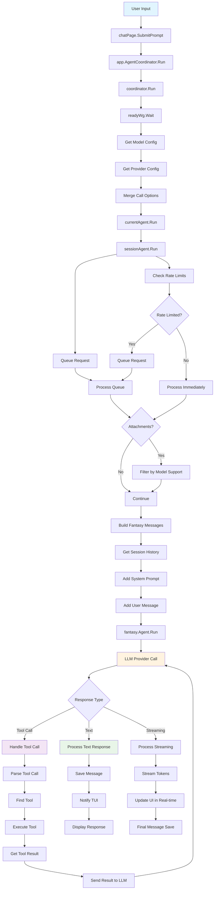
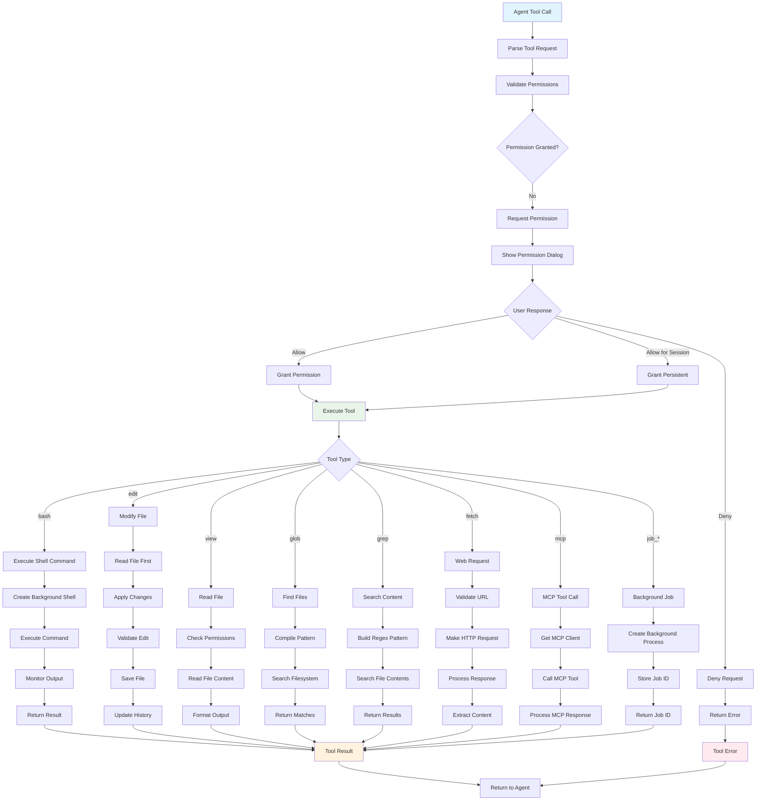
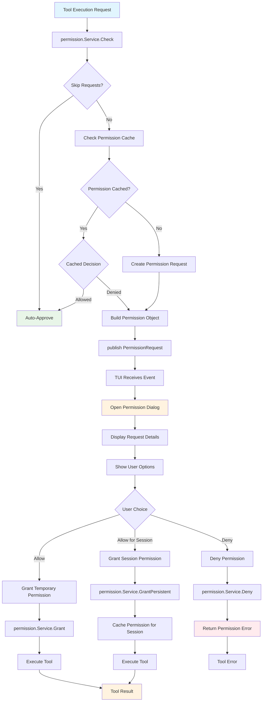
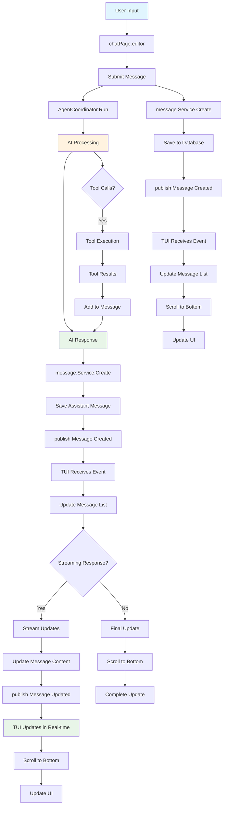
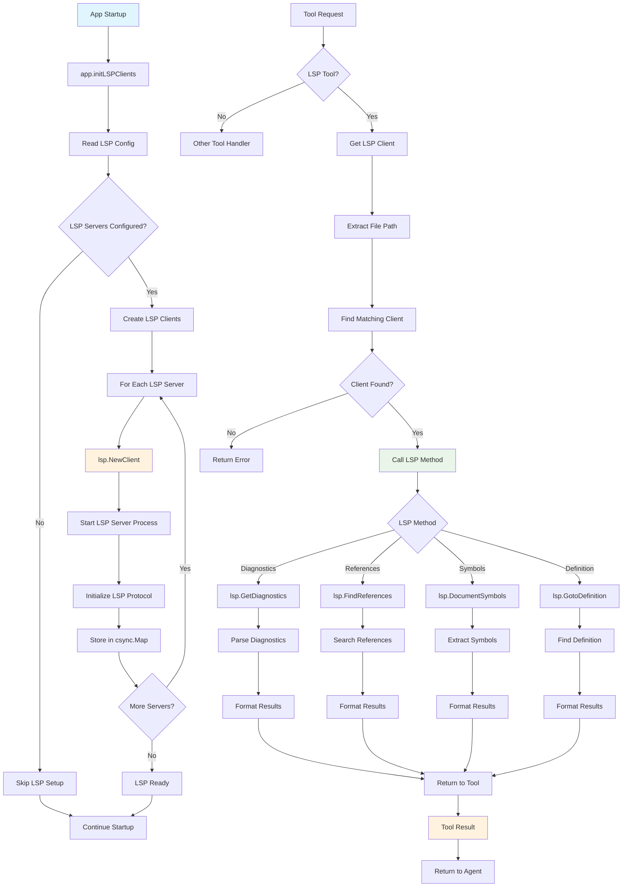
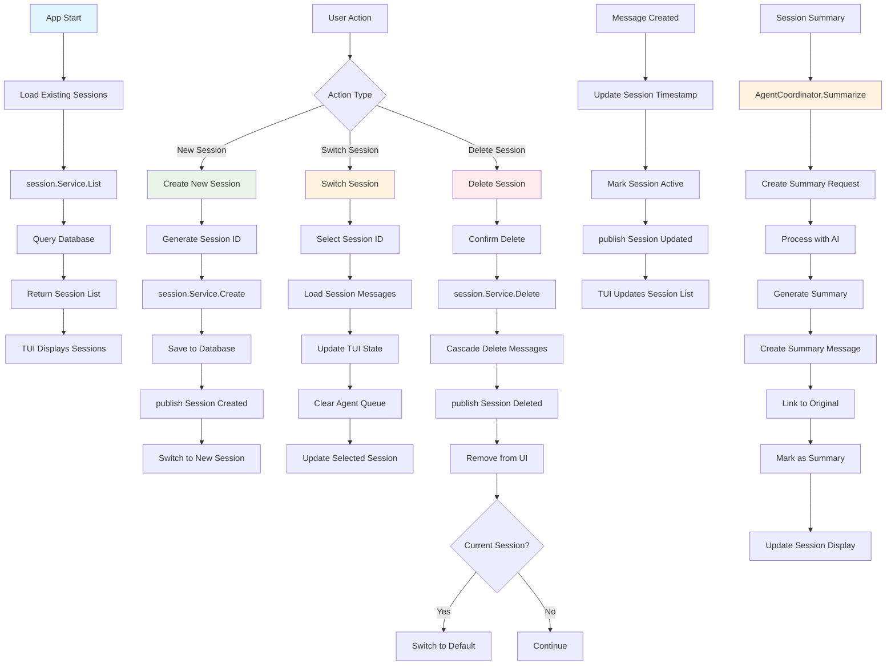

# Crush Application Call Flow Analysis

This document provides comprehensive call flow diagrams for the Crush AI assistant application, showing the complete system architecture and interaction patterns.

## Table of Contents

1. [Application Startup Flow](#application-startup-flow)
2. [TUI Event Loop Flow](#tui-event-loop-flow) 
3. [Agent Processing Flow](#agent-processing-flow)
4. [Tool Execution Flow](#tool-execution-flow)
5. [Permission Management Flow](#permission-management-flow)
6. [Message Flow Architecture](#message-flow-architecture)
7. [LSP Integration Flow](#lsp-integration-flow)
8. [Session Management Flow](#session-management-flow)

---

## Application Startup Flow

### Startup Sequence Details

The application follows this initialization sequence:

1. **Main Entry Point** (`main.go:13-24`)
   - Sets up profiling if `CRUSH_PROFILE` is enabled
   - Delegates to `cmd.Execute()`

2. **Command Setup** (`cmd/root.go:77-104`)
   - Resolves working directory
   - Initializes configuration
   - Creates database connection
   - Sets up TUI with Bubble Tea

3. **App Service Creation** (`app/app.go:65-117`)
   - Creates core services (sessions, messages, history, permissions)
   - Initializes agent coordinator
   - Sets up LSP and MCP clients
   - Configures event subscriptions

4. **TUI Initialization** (`tui/tui.go:687-708`)
   - Creates chat page and dialogs
   - Sets up key bindings
   - Configures completions system

---

## TUI Event Loop Flow

### TUI Event Processing Details

The TUI uses Bubble Tea's Elm architecture:

1. **Message Distribution** (`tui/tui.go:111-411`)
   - Routes messages to appropriate handlers
   - Manages dialog state and page transitions
   - Handles keyboard shortcuts and global actions

2. **Page Management** (`tui/tui.go:553-574`)
   - Maintains loaded pages cache
   - Handles page initialization and sizing
   - Prevents navigation during agent operations

3. **Dialog System** (`tui/tui.go:169-321`)
   - Manages modal dialogs overlay
   - Handles permission requests
   - Processes user interactions

---

## Agent Processing Flow

### Agent Processing Details

The agent system handles AI interactions:

1. **Request Queuing** (`internal/agent/agent.go`)
   - Manages concurrent requests per session
   - Handles rate limiting and priority
   - Maintains cancellation contexts

2. **Tool Execution** (`internal/agent/tools/`)
   - Dynamic tool discovery and execution
   - Permission validation
   - Result processing and error handling

3. **Response Streaming** (`internal/agent/coordinator.go:110-145`)
   - Real-time response streaming
   - Token usage tracking
   - Error recovery

---

## Tool Execution Flow

### Tool System Details

The tool system provides file system and development capabilities:

1. **Permission Validation** (`internal/permission/`)
   - Checks tool access permissions
   - Handles user approval workflow
   - Maintains session-specific permissions

2. **Tool Categories** (`internal/agent/tools/`)
   - **File Operations**: `edit.go`, `view.go`, `write.go`, `multiedit.go`
   - **Shell Operations**: `bash.go`, `job_kill.go`, `job_output.go`
   - **Search Operations**: `glob.go`, `grep.go`, `sourcegraph.go`
   - **Network Operations**: `fetch.go`, `agentic_fetch.go`, `download.go`
   - **LSP Operations**: `diagnostics.go`, `references.go`
   - **MCP Tools**: `mcp-tools.go`

3. **Background Processing** (`internal/shell/background.go`)
   - Manages long-running shell commands
   - Provides job control capabilities
   - Handles output streaming

---

## Permission Management Flow

### Permission System Details

The permission system ensures secure tool execution:

1. **Permission Types** (`internal/permission/permission.go`)
   - **Temporary**: Single-use permission
   - **Session**: Permission for current session
   - **Persistent**: Saved permission for future sessions

2. **Permission Dialog** (`internal/tui/components/dialogs/permissions/`)
   - Shows tool request details
   - Displays file changes (diff mode)
   - Provides allow/deny options

3. **Auto-Approval Modes**
   - **YOLO Mode**: `-y` flag auto-approves all requests
   - **Session Auto-approval**: Non-interactive mode

---

## Message Flow Architecture

### Message System Details

The message system handles all conversation data:

1. **Message Types** (`internal/message/message.go`)
   - **User**: User input messages
   - **Assistant**: AI responses
   - **System**: System notifications
   - **Tool**: Tool call and results

2. **Message Storage** (`internal/db/messages.sql.go`)
   - SQLite database storage
   - Full-text search capabilities
   - Attachment support

3. **Event Publishing** (`internal/pubsub/`)
   - Real-time message updates
   - TUI synchronization
   - Component communication

---

## LSP Integration Flow

### LSP System Details

The LSP integration provides IDE-like capabilities:

1. **LSP Client Management** (`internal/lsp/client.go`)
   - Process lifecycle management
   - Protocol communication
   - Error handling and reconnection

2. **LSP Tools** (`internal/agent/tools/`)
   - **Diagnostics**: `diagnostics.go` - error/warning highlighting
   - **References**: `references.go` - find usages and go-to-definition

3. **Language Detection** (`internal/lsp/language.go`)
   - File extension mapping
   - Dynamic server selection
   - Configuration inheritance

---

## Session Management Flow

### Session System Details

The session system manages conversation contexts:

1. **Session Lifecycle** (`internal/session/session.go`)
   - Creation, deletion, and switching
   - Message association
   - Metadata management

2. **Session Features**
   - **Auto-save**: Messages automatically saved
   - **Summarization**: Long conversation compression
   - **Persistence**: Survives application restarts

3. **Database Operations** (`internal/db/sessions.sql.go`)
   - CRUD operations
   - Message relationship management
   - Full-text search indexing

---

## Summary

The Crush application follows a clean, event-driven architecture with clear separation of concerns:

### Key Architectural Patterns

1. **Event-Driven Communication**
   - Pub/sub system for loose coupling
   - Real-time UI updates
   - Async message processing

2. **Service Layer Pattern**
   - Clear service boundaries
   - Dependency injection
   - Testable components

3. **Tool-Based Agent System**
   - Extensible tool ecosystem
   - Permission-gated execution
   - Background processing support

4. **Reactive UI Architecture**
   - Elm-style update loop
   - State management
   - Component composition

### Critical Flow Integration Points

1. **User Input → Agent Processing**
   - TUI captures and validates input
   - Agent coordinator manages AI interaction
   - Tools provide execution capabilities

2. **Permission System Integration**
   - All tool operations pass through permissions
   - User approval workflow
   - Session-based permission caching

3. **LSP Integration**
   - Language-specific server management
   - IDE-like features in terminal
   - Tool integration for code intelligence

This architecture enables a powerful, extensible AI assistant that operates entirely within the terminal while maintaining security and performance standards.