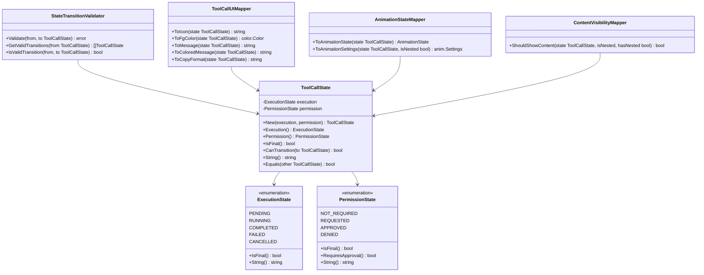

# ToolCallState Call Graph - Improved Implementation

## Improved Implementation Design

The improved `ToolCallState` implementation addresses all architectural issues through separation of concerns and clean architecture principles.

### Architecture Principles Applied:
1. **Single Responsibility** - Each component has one clear purpose
2. **Separation of Concerns** - State logic separate from UI rendering
3. **Dependency Inversion** - State doesn't depend on UI packages
4. **Explicit Transitions** - Clear state machine with validation
5. **Composability** - Separate concerns can be combined

### Improved State Structure:

### Improved Class Hierarchy:

### Improved State Machine:

### Improved Dependency Flow:

### Improved State Transition Matrix:

### Improved Usage Pattern:

### Improved Error Handling:

### Benefits of Improved Design:
1. **Clean Separation** - State logic isolated from UI concerns
2. **Testability** - Pure state functions, easy to unit test
3. **Extensibility** - New UI styles without changing state
4. **Maintainability** - Single responsibility for each component
5. **Type Safety** - Compile-time validation of transitions
6. **Performance** - No UI package dependencies in state
7. **Flexibility** - Composite states allow complex combinations

### Migration Strategy:

This improved design transforms the monolithic state enum into a clean, testable, and maintainable state management system that follows SOLID principles and clean architecture practices.