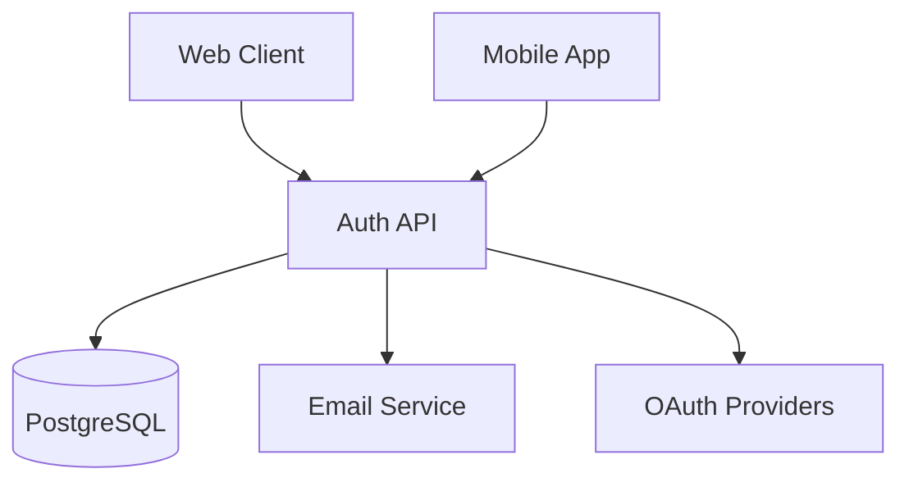
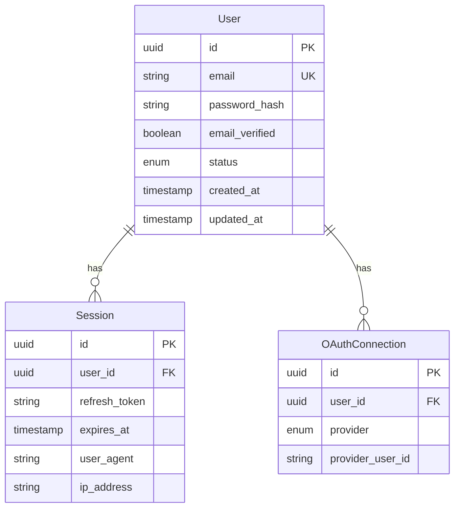

# Spec-Driven Orchestration: Blueprints → Construction → Execution

## Overview

A spec-first development system where a single source of truth (spec sheet) generates all documentation, schemas, and tasks. When specs change, everything downstream updates automatically.

```
┌─────────────────────────────────────────────────────────────────────────┐
│                          SPEC SHEET                                      │
│                    (Single Source of Truth)                              │
│                                                                          │
│  What we're building, why, constraints, requirements                     │
└─────────────────────────────────────────────────────────────────────────┘
                                    │
                                    ▼
┌─────────────────────────────────────────────────────────────────────────┐
│                          BLUEPRINTS                                      │
│                                                                          │
│  High-level architecture, user stories, domain models                    │
│  Generated from specs, human-reviewed                                    │
└─────────────────────────────────────────────────────────────────────────┘
                                    │
                                    ▼
┌─────────────────────────────────────────────────────────────────────────┐
│                    CONSTRUCTION DOCUMENTS                                │
│                                                                          │
│  Prisma schemas • API definitions • Database designs • Contracts        │
│  Auto-generated, version-controlled                                      │
└─────────────────────────────────────────────────────────────────────────┘
                                    │
                                    ▼
┌─────────────────────────────────────────────────────────────────────────┐
│                           PHASES                                         │
│                                                                          │
│  Foundation → Core → Features → Polish → Ship                           │
│  Dependencies mapped, parallel work identified                           │
└─────────────────────────────────────────────────────────────────────────┘
                                    │
                                    ▼
┌─────────────────────────────────────────────────────────────────────────┐
│                           TASKS                                          │
│                                                                          │
│  Granular work items assigned to agents                                  │
│  Linked back to specs, blueprints, construction docs                     │
└─────────────────────────────────────────────────────────────────────────┘
                                    │
                                    ▼
┌─────────────────────────────────────────────────────────────────────────┐
│                         EXECUTION                                        │
│                                                                          │
│  Agents work in worktrees, humans observe and oversee                    │
│  Real-time visualization, GitHub collaboration                           │
└─────────────────────────────────────────────────────────────────────────┘

                         ⬆ FEEDBACK LOOP ⬆
          When specs are wrong → Update spec → Regenerate downstream
```

---

## Level 1: Spec Sheet

The single source of truth. Everything flows from here.

### Spec Sheet Format

```yaml
# specs/auth-system.yaml
id: spec-001
name: User Authentication System
version: 1.2.0
status: active
owner: alice
created: 2024-01-15

description: |
  Implement a complete user authentication system with JWT tokens,
  supporting email/password login, OAuth providers, and session management.

goals:
  - Secure user authentication for the platform
  - Support multiple auth providers (email, Google, GitHub)
  - Enable session persistence across devices
  - Provide admin tools for user management

non_goals:
  - Two-factor authentication (future phase)
  - Enterprise SSO integration (future phase)
  - Passwordless auth (future phase)

constraints:
  technical:
    - Must use PostgreSQL for user data
    - Must be compatible with existing Go backend
    - JWT tokens must expire within 24 hours
    - All endpoints must be rate-limited

  business:
    - Launch by Q2 2024
    - Must pass security audit
    - GDPR compliant data handling

  resources:
    - Backend team: 2 developers
    - AI agents: planner, coder, reviewer, tester
    - Budget: 40 agent-hours

requirements:
  functional:
    - id: FR-001
      description: User can register with email and password
      priority: P0
      acceptance_criteria:
        - Email validation (RFC 5322)
        - Password strength requirements (8+ chars, mixed case, number, symbol)
        - Confirmation email sent
        - Duplicate email rejection

    - id: FR-002
      description: User can login with email and password
      priority: P0
      acceptance_criteria:
        - Returns JWT access token (15 min expiry)
        - Returns refresh token (7 day expiry)
        - Rate limited: 5 attempts per minute
        - Account lockout after 10 failed attempts

    - id: FR-003
      description: User can login with OAuth providers
      priority: P1
      providers: [Google, GitHub]
      acceptance_criteria:
        - OAuth 2.0 flow
        - Creates user record on first login
        - Links to existing account if email matches

    - id: FR-004
      description: User can refresh access token
      priority: P0
      acceptance_criteria:
        - Validates refresh token
        - Issues new access token
        - Rotation of refresh token

    - id: FR-005
      description: User can logout
      priority: P0
      acceptance_criteria:
        - Invalidates refresh token
        - Clears server-side session

    - id: FR-006
      description: Admin can view and manage users
      priority: P2
      acceptance_criteria:
        - List users with pagination
        - Disable/enable user accounts
        - Force password reset

  non_functional:
    - id: NFR-001
      category: security
      description: All passwords must be hashed with bcrypt
      details: Cost factor 12, never log or expose

    - id: NFR-002
      category: security
      description: All tokens must be signed with RS256
      details: Private key in secrets manager, public key for validation

    - id: NFR-003
      category: performance
      description: Authentication must complete in <200ms
      details: P99 latency target

    - id: NFR-004
      category: reliability
      description: 99.9% uptime for auth endpoints
      details: Critical path for all users

entities:
  - name: User
    description: A registered user of the platform
    fields:
      - name: id
        type: UUID
        description: Unique identifier
      - name: email
        type: string
        description: User's email address (unique)
      - name: password_hash
        type: string
        description: Bcrypt hashed password
      - name: email_verified
        type: boolean
        description: Whether email has been verified
      - name: created_at
        type: timestamp
        description: Account creation time
      - name: updated_at
        type: timestamp
        description: Last update time
      - name: status
        type: enum
        values: [active, disabled, pending_verification]
        description: Account status

  - name: Session
    description: User login session
    fields:
      - name: id
        type: UUID
      - name: user_id
        type: UUID
        references: User.id
      - name: refresh_token
        type: string
      - name: expires_at
        type: timestamp
      - name: created_at
        type: timestamp
      - name: user_agent
        type: string
      - name: ip_address
        type: string

  - name: OAuthConnection
    description: OAuth provider connection
    fields:
      - name: id
        type: UUID
      - name: user_id
        type: UUID
        references: User.id
      - name: provider
        type: enum
        values: [google, github]
      - name: provider_user_id
        type: string
      - name: created_at
        type: timestamp

api_endpoints:
  - path: /auth/register
    method: POST
    requirement: FR-001
    description: Register new user
    request:
      email: string
      password: string
    response:
      user: User
      message: string
    errors:
      - code: EMAIL_EXISTS
        message: Email already registered
      - code: WEAK_PASSWORD
        message: Password does not meet requirements

  - path: /auth/login
    method: POST
    requirement: FR-002
    description: Login with email/password
    request:
      email: string
      password: string
    response:
      access_token: string
      refresh_token: string
      expires_in: number
      user: User
    errors:
      - code: INVALID_CREDENTIALS
        message: Invalid email or password
      - code: ACCOUNT_LOCKED
        message: Account temporarily locked

  - path: /auth/refresh
    method: POST
    requirement: FR-004
    description: Refresh access token
    request:
      refresh_token: string
    response:
      access_token: string
      refresh_token: string
      expires_in: number

  - path: /auth/logout
    method: POST
    requirement: FR-005
    description: Logout user
    request:
      refresh_token: string
    response:
      message: string

  - path: /auth/oauth/{provider}
    method: GET
    requirement: FR-003
    description: Initiate OAuth flow
    providers: [google, github]

  - path: /auth/oauth/{provider}/callback
    method: GET
    requirement: FR-003
    description: OAuth callback handler

dependencies:
  internal:
    - Database connection pool (existing)
    - Email service (existing)
    - Secrets manager (existing)

  external:
    - Google OAuth API credentials
    - GitHub OAuth App credentials

metadata:
  created_by: alice
  reviewed_by: bob
  approved: true
  last_updated: 2024-01-15T10:30:00Z
```

---

## Level 2: Blueprints

Generated from specs, human-reviewed, high-level architecture.

### Blueprint Generation

```bash
crush blueprint generate specs/auth-system.yaml
```

Generates:

```
blueprints/
├── auth-system/
│   ├── README.md              # Executive summary
│   ├── architecture.md        # System architecture
│   ├── user-stories.md        # User stories from requirements
│   ├── domain-model.md        # Entity relationships
│   ├── api-contracts.md       # API endpoint contracts
│   ├── security-model.md      # Security considerations
│   ├── data-flow.md           # Data flow diagrams
│   └── decisions/             # Architecture Decision Records
│       ├── ADR-001-jwt-strategy.md
│       ├── ADR-002-oauth-flow.md
│       └── ADR-003-session-management.md
```

### Example: Architecture Blueprint

```markdown
# Authentication System Architecture

Generated from: specs/auth-system.yaml v1.2.0
Generated at: 2024-01-15T11:00:00Z

## Overview

[Auto-generated summary from spec description and goals]

## System Context



## Components

### Auth Service (New)
- JWT token generation and validation
- Session management
- OAuth flow orchestration

### User Store (New)
- User CRUD operations
- Password hashing/verification
- OAuth connection management

### Middleware (New)
- Token validation
- Rate limiting
- Request logging

## Security Model

[Generated from non_functional requirements and constraints]

## Data Model



## Open Questions

- [ ] Token rotation strategy for refresh tokens?
- [ ] Session cleanup policy?
- [ ] Password reset flow details?

---
*This blueprint was generated by crush. Review and update the spec to regenerate.*
```

---

## Level 3: Construction Documents

Technical artifacts auto-generated from blueprints/specs.

### Construction Document Types

```
construction/
├── auth-system/
│   ├── prisma/
│   │   └── schema.prisma       # Database schema
│   ├── api/
│   │   ├── openapi.yaml        # OpenAPI spec
│   │   └── routes.md           # Route documentation
│   ├── database/
│   │   ├── migrations/         # SQL migrations
│   │   └── seeds/              # Seed data
│   ├── contracts/
│   │   ├── user-service.ts     # TypeScript interfaces
│   │   └── auth-events.ts      # Event definitions
│   ├── tests/
│   │   ├── api-tests.postman.json
│   │   └── load-tests.yaml
│   └── infrastructure/
│       ├── rate-limits.yaml
│       └── secrets-required.yaml
```

### Prisma Schema (Generated)

```prisma
// construction/auth-system/prisma/schema.prisma
// Generated from: specs/auth-system.yaml v1.2.0
// DO NOT EDIT DIRECTLY - Update spec and regenerate

generator client {
  provider = "go"
  output   = "./db"
}

datasource db {
  provider = "postgresql"
  url      = env("DATABASE_URL")
}

// Entity: User
// Source: specs/auth-system.yaml#entities[0]
model User {
  id            String         @id @default(uuid())
  email         String         @unique
  passwordHash  String         @map("password_hash") @db.VarChar(128)
  emailVerified Boolean        @default(false) @map("email_verified")
  status        UserStatus     @default(PENDING_VERIFICATION)
  createdAt     DateTime       @default(now()) @map("created_at")
  updatedAt     DateTime       @updatedAt @map("updated_at")

  sessions        Session[]
  oauthConnections OAuthConnection[]

  @@map("users")
}

enum UserStatus {
  ACTIVE
  DISABLED
  PENDING_VERIFICATION @map("pending_verification")
}

// Entity: Session
// Source: specs/auth-system.yaml#entities[1]
model Session {
  id           String   @id @default(uuid())
  userId       String   @map("user_id")
  refreshToken String   @map("refresh_token") @db.VarChar(512)
  expiresAt    DateTime @map("expires_at")
  createdAt    DateTime @default(now()) @map("created_at")
  userAgent    String?  @map("user_agent") @db.Text
  ipAddress    String?  @map("ip_address") @db.VarChar(45)

  user User @relation(fields: [userId], references: [id], onDelete: Cascade)

  @@index([userId])
  @@index([refreshToken])
  @@map("sessions")
}

// Entity: OAuthConnection
// Source: specs/auth-system.yaml#entities[2]
model OAuthConnection {
  id             String       @id @default(uuid())
  userId         String       @map("user_id")
  provider       OAuthProvider
  providerUserId String       @map("provider_user_id")
  createdAt      DateTime     @default(now()) @map("created_at")

  user User @relation(fields: [userId], references: [id], onDelete: Cascade)

  @@unique([provider, providerUserId])
  @@index([userId])
  @@map("oauth_connections")
}

enum OAuthProvider {
  GOOGLE
  GITHUB
}
```

### OpenAPI Spec (Generated)

```yaml
# construction/auth-system/api/openapi.yaml
# Generated from: specs/auth-system.yaml v1.2.0
# DO NOT EDIT DIRECTLY - Update spec and regenerate

openapi: 3.1.0
info:
  title: Authentication API
  version: 1.0.0
  description: User authentication system with JWT and OAuth

servers:
  - url: /api/v1

paths:
  /auth/register:
    post:
      summary: Register new user
      operationId: registerUser
      requirement: FR-001
      tags: [Authentication]
      requestBody:
        required: true
        content:
          application/json:
            schema:
              $ref: '#/components/schemas/RegisterRequest'
      responses:
        '201':
          description: User created
          content:
            application/json:
              schema:
                $ref: '#/components/schemas/RegisterResponse'
        '400':
          description: Validation error
          content:
            application/json:
              schema:
                $ref: '#/components/schemas/Error'
        '409':
          description: Email already exists
          content:
            application/json:
              schema:
                $ref: '#/components/schemas/Error'

  /auth/login:
    post:
      summary: Login with email and password
      operationId: login
      requirement: FR-002
      tags: [Authentication]
      requestBody:
        required: true
        content:
          application/json:
            schema:
              $ref: '#/components/schemas/LoginRequest'
      responses:
        '200':
          description: Login successful
          content:
            application/json:
              schema:
                $ref: '#/components/schemas/TokenResponse'
        '401':
          description: Invalid credentials
          content:
            application/json:
              schema:
                $ref: '#/components/schemas/Error'
        '423':
          description: Account locked
          content:
            application/json:
              schema:
                $ref: '#/components/schemas/Error'

components:
  schemas:
    User:
      type: object
      properties:
        id:
          type: string
          format: uuid
        email:
          type: string
          format: email
        emailVerified:
          type: boolean
        status:
          $ref: '#/components/schemas/UserStatus'
        createdAt:
          type: string
          format: date-time

    UserStatus:
      type: string
      enum: [active, disabled, pending_verification]

    RegisterRequest:
      type: object
      required: [email, password]
      properties:
        email:
          type: string
          format: email
        password:
          type: string
          minLength: 8

    LoginRequest:
      type: object
      required: [email, password]
      properties:
        email:
          type: string
          format: email
        password:
          type: string

    TokenResponse:
      type: object
      properties:
        accessToken:
          type: string
        refreshToken:
          type: string
        expiresIn:
          type: integer
        user:
          $ref: '#/components/schemas/User'

    Error:
      type: object
      properties:
        code:
          type: string
        message:
          type: string
```

---

## Level 4: Phases

Work broken into phases with dependencies.

### Phase Definition

```yaml
# .orchestra/phases/auth-system.yaml
project: auth-system
spec_version: 1.2.0

phases:
  - id: phase-1
    name: Foundation
    description: Database schema, models, and core utilities
    dependencies: []
    requirements: [FR-001, FR-002, NFR-001, NFR-002]
    deliverables:
      - Prisma schema deployed
      - Database migrations run
      - User model with password hashing
      - Basic auth middleware
    estimated_hours: 8
    status: completed

  - id: phase-2
    name: Core Auth
    description: Registration and login endpoints
    dependencies: [phase-1]
    requirements: [FR-001, FR-002, FR-004, FR-005]
    deliverables:
      - /auth/register endpoint
      - /auth/login endpoint
      - /auth/refresh endpoint
      - /auth/logout endpoint
      - JWT generation and validation
    estimated_hours: 12
    status: in_progress

  - id: phase-3
    name: OAuth Integration
    description: Google and GitHub OAuth providers
    dependencies: [phase-2]
    requirements: [FR-003]
    deliverables:
      - OAuth flow handlers
      - OAuthConnection model
      - Provider integration tests
    estimated_hours: 10
    status: pending

  - id: phase-4
    name: Admin Tools
    description: User management for admins
    dependencies: [phase-2]
    requirements: [FR-006]
    deliverables:
      - Admin user list endpoint
      - User enable/disable
      - Password reset trigger
    estimated_hours: 6
    status: pending

  - id: phase-5
    name: Polish & Security
    description: Rate limiting, security audit prep
    dependencies: [phase-2, phase-3]
    requirements: [NFR-003, NFR-004]
    deliverables:
      - Rate limiting on all endpoints
      - Security audit checklist
      - Load testing
      - Documentation
    estimated_hours: 8
    status: pending
```

### Phase Visualization

```
┌─────────────────────────────────────────────────────────────────────────┐
│  AUTH SYSTEM: Phases                                Progress: 35%      │
├─────────────────────────────────────────────────────────────────────────┤
│                                                                          │
│  Phase 1: Foundation ─────────────────────────────────────── ✓ DONE    │
│  ├─ T-001 Setup Prisma schema                              ✓           │
│  ├─ T-002 Create User model                                ✓           │
│  └─ T-003 Implement password hashing                       ✓           │
│                                                                          │
│  Phase 2: Core Auth ──────────────────────────────────────── ⚡ ACTIVE  │
│  ├─ T-004 Implement /auth/register                         ✓           │
│  ├─ T-005 Implement /auth/login                            ⚡          │
│  ├─ T-006 Implement /auth/refresh                          ○          │
│  └─ T-007 Implement /auth/logout                           ○          │
│                                                                          │
│  Phase 3: OAuth Integration ──────────────────────────────── ○ PENDING  │
│  │  (blocked by Phase 2)                                                 │
│  ├─ T-008 Google OAuth flow                                ○          │
│  ├─ T-009 GitHub OAuth flow                                ○          │
│  └─ T-010 OAuth connection model                           ○          │
│                                                                          │
│  Phase 4: Admin Tools ────────────────────────────────────── ○ PENDING  │
│  │  (blocked by Phase 2)                                                 │
│                                                                          │
│  Phase 5: Polish & Security ─────────────────────────────── ○ PENDING  │
│     (blocked by Phase 2, Phase 3)                                        │
│                                                                          │
└─────────────────────────────────────────────────────────────────────────┘
  Legend: ✓ Done   ⚡ Active   ○ Pending   ✗ Blocked
```

---

## Level 5: Tasks

Granular work items derived from phases.

### Task Generation

```bash
crush tasks generate phase-2
```

Generates tasks linked to requirements:

```yaml
# .orchestra/tasks/T-005.yaml
id: T-005
title: Implement /auth/login endpoint
phase: phase-2
requirement: FR-002
status: in_progress
created: 2024-01-15T14:00:00Z

links:
  spec: specs/auth-system.yaml#requirements.functional[1]
  blueprint: blueprints/auth-system/api-contracts.md#auth-login
  construction: construction/auth-system/api/openapi.yaml#paths./auth/login
  prisma: construction/auth-system/prisma/schema.prisma#model-User

acceptance_criteria:
  - Returns JWT access token (15 min expiry)
  - Returns refresh token (7 day expiry)
  - Rate limited: 5 attempts per minute
  - Account lockout after 10 failed attempts
  - Validates email format
  - Verifies password against hash

implementation_hints:
  - Use bcrypt.CompareHashAndPassword for password verification
  - Generate JWT with RS256 signing
  - Store refresh token hash in sessions table
  - Use redis for rate limiting

tests:
  - unit: TestLoginHandler_Success
  - unit: TestLoginHandler_InvalidCredentials
  - unit: TestLoginHandler_RateLimit
  - integration: TestLoginEndpoint_E2E

assigned_agent: coder
branch: task/T-005/coder
```

---

## The Feedback Loop

When specs are wrong, the cascade updates:

```
┌────────────────────────────────────────────────────────────────────────┐
│                         SPEC CHANGE                                     │
│                                                                         │
│  User updates: specs/auth-system.yaml                                   │
│  Change: "Password must be 12+ chars (was 8+)"                          │
└────────────────────────────────────────────────────────────────────────┘
                                    │
                                    ▼
┌────────────────────────────────────────────────────────────────────────┐
│                    DETECT DOWNSTREAM IMPACTS                            │
│                                                                         │
│  Analyzing what needs to update...                                      │
│                                                                         │
│  ✗ construction/auth-system/api/openapi.yaml                            │
│    - RegisterRequest.password.minLength: 8 → 12                        │
│                                                                         │
│  ✗ blueprints/auth-system/security-model.md                             │
│    - Password policy section needs update                               │
│                                                                         │
│  ✗ Task T-001 (completed) - May need rework                             │
│    - Validation in register handler                                     │
│                                                                         │
│  ✗ Task T-004 (completed) - May need rework                             │
│    - Password validation regex                                          │
│                                                                         │
│  ✓ Task T-005 (in progress) - Update before continue                    │
└────────────────────────────────────────────────────────────────────────┘
                                    │
                                    ▼
┌────────────────────────────────────────────────────────────────────────┐
│                    REGENERATE DOCUMENTS                                 │
│                                                                         │
│  Regenerating affected files...                                         │
│                                                                         │
│  ✓ Updated: construction/auth-system/api/openapi.yaml                   │
│  ✓ Updated: blueprints/auth-system/security-model.md                    │
│  ✓ Created: specs/auth-system.yaml.change-001.md (change log)          │
│                                                                         │
│  Tasks requiring review:                                                │
│  ⚠️  T-001 (completed) - Validate and potentially redo                  │
│  ⚠️  T-004 (completed) - Validate and potentially redo                  │
│  ⚠️  T-005 (in progress) - Updated criteria, continue when ready       │
└────────────────────────────────────────────────────────────────────────┘
                                    │
                                    ▼
┌────────────────────────────────────────────────────────────────────────┐
│                    RIPPLE ANALYSIS                                      │
│                                                                         │
│  What code changes are needed?                                          │
│                                                                         │
│  📁 internal/handlers/auth.go                                           │
│     └─ validatePassword() - Update min length check                    │
│                                                                         │
│  📁 internal/validation/password.go                                     │
│     └─ MinLength constant: 8 → 12                                      │
│                                                                         │
│  📁 frontend/components/RegisterForm.tsx                                │
│     └─ Password hint text update                                        │
│                                                                         │
│  📁 tests/unit/auth_test.go                                             │
│     └─ Update test cases for new requirement                           │
│                                                                         │
│  Create follow-up tasks?                                                │
│  [Yes, create tasks]  [No, just flag]  [Review first]                  │
└────────────────────────────────────────────────────────────────────────┘
```

### Impact Detection

```go
type SpecChangeAnalyzer struct {
    specPath    string
    specVersion string
}

type SpecChange struct {
    Path        string    // JSON path to changed field
    OldValue    any       // Previous value
    NewValue    any       // New value
    ImpactLevel ImpactLevel
    Affected    []AffectedItem
}

type AffectedItem struct {
    Type     string // "blueprint", "construction", "task"
    Path     string // File path or task ID
    Field    string // Specific field affected
    Action   string // "update", "regenerate", "rework", "validate"
}

func (a *SpecChangeAnalyzer) Analyze(change SpecChange) []AffectedItem {
    var affected []AffectedItem

    // Find all generated files that reference this spec field
    references := a.findReferences(change.Path)

    for _, ref := range references {
        switch ref.Type {
        case "blueprint":
            affected = append(affected, AffectedItem{
                Type:   "blueprint",
                Path:   ref.Path,
                Action: "regenerate",
            })
        case "construction":
            affected = append(affected, AffectedItem{
                Type:   "construction",
                Path:   ref.Path,
                Action: "regenerate",
            })
        case "task":
            task := a.loadTask(ref.TaskID)
            if task.Status == "completed" {
                affected = append(affected, AffectedItem{
                    Type:   "task",
                    Path:   ref.TaskID,
                    Action: "validate", // May need rework
                })
            }
        }
    }

    return affected
}
```

---

## Directory Structure

```
project/
├── specs/                          # Level 1: Spec Sheets
│   ├── auth-system.yaml
│   ├── payment-system.yaml
│   └── user-profile.yaml
│
├── blueprints/                     # Level 2: Blueprints (generated)
│   ├── auth-system/
│   │   ├── README.md
│   │   ├── architecture.md
│   │   ├── user-stories.md
│   │   ├── domain-model.md
│   │   └── decisions/
│   └── payment-system/
│
├── construction/                   # Level 3: Construction Docs (generated)
│   ├── auth-system/
│   │   ├── prisma/
│   │   │   └── schema.prisma
│   │   ├── api/
│   │   │   ├── openapi.yaml
│   │   │   └── routes.md
│   │   ├── contracts/
│   │   │   ├── user-service.ts
│   │   │   └── auth-events.ts
│   │   └── tests/
│   │       └── api-tests.postman.json
│   └── shared/                     # Shared across projects
│       └── prisma/
│           └── base.prisma
│
├── .orchestra/                     # Orchestration state
│   ├── config.yaml                 # Team/agent configuration
│   ├── phases/                     # Level 4: Phase definitions
│   │   ├── auth-system.yaml
│   │   └── payment-system.yaml
│   ├── tasks/                      # Level 5: Task definitions
│   │   ├── T-001.yaml
│   │   ├── T-002.yaml
│   │   └── ...
│   ├── ledgers/                    # Task & progress ledgers
│   └── sessions/                   # Active sessions
│
├── worktrees/                      # Agent worktrees (git worktrees)
│   └── T-005/
│       └── coder/                  # Coder's workspace for T-005
│
└── src/                            # Actual source code
    ├── internal/
    ├── api/
    └── ...
```

---

## CLI Commands

### Spec Management

```bash
# Create new spec
crush spec create "User authentication system"

# Validate spec
crush spec validate specs/auth-system.yaml

# View spec
crush spec show auth-system

# Update spec (triggers cascade)
crush spec edit auth-system

# View change history
crush spec history auth-system

# Compare versions
crush spec diff auth-system v1.1.0 v1.2.0
```

### Blueprint Management

```bash
# Generate blueprints from spec
crush blueprint generate auth-system

# View blueprint
crush blueprint show auth-system architecture

# Regenerate all blueprints
crush blueprint regenerate --all

# Review pending changes
crush blueprint pending
```

### Construction Management

```bash
# Generate construction docs
crush construction generate auth-system

# Generate specific artifact
crush construction generate auth-system prisma
crush construction generate auth-system openapi

# Validate construction against spec
crush construction validate auth-system

# Apply migrations
crush construction apply auth-system --migrate
```

### Phase & Task Management

```bash
# Generate phases from spec
crush phase generate auth-system

# View phases
crush phase show auth-system

# Start a phase
crush phase start phase-2

# Generate tasks from phase
crush task generate phase-2

# View task with all links
crush task show T-005 --links

# Start task (creates worktree, spawns agent)
crush task start T-005
```

### Change Management

```bash
# When spec changes, analyze impact
crush spec change auth-system --analyze

# Show what needs updating
crush spec impact auth-system

# Apply changes (regenerate docs, update tasks)
crush spec apply auth-system

# Validate completed work against new spec
crush spec validate-work auth-system
```

---

## Workflow Example

### Day 1: Start Project

```bash
# 1. Create spec
crush spec create "Authentication system"
# Opens editor with spec template

# 2. Generate blueprints
crush blueprint generate auth-system
# Creates: architecture.md, user-stories.md, domain-model.md

# 3. Review blueprints
crush blueprint show auth-system architecture
# Human reviews, requests changes if needed

# 4. Generate construction docs
crush construction generate auth-system
# Creates: prisma/schema.prisma, api/openapi.yaml

# 5. Generate phases
crush phase generate auth-system
# Creates phases based on requirements

# 6. Start phase 1
crush phase start phase-1
# Generates tasks, spawns agents
```

### Day 2: Observe Work

```bash
# Check status
crush status

# Open visualization
crush dashboard

# Watch specific task
crush task watch T-005

# Comment on agent work
crush task comment T-005 "Make sure to hash passwords with cost factor 12"
```

### Day 3: Spec Change

```bash
# Oops, we need 12 char passwords, not 8
crush spec edit auth-system
# Update: password minLength: 8 → 12

# Analyze impact
crush spec impact auth-system
# Shows: T-001, T-004 need review, T-005 needs update

# Apply changes
crush spec apply auth-system
# Regenerates docs, updates tasks

# Validate existing work
crush spec validate-work auth-system
# Runs tests, checks if completed tasks match new spec
```

### Day 4: Collaborate

```bash
# Your friend joins
crush status --all
# Shows all active work

# Friend takes a task
crush task join T-008

# See friend's progress
crush task watch T-008
```

---

## Benefits

| Level | Benefit |
|-------|---------|
| **Spec** | Single source of truth, version controlled |
| **Blueprints** | Human-readable architecture, easy review |
| **Construction** | Auto-generated, always in sync with spec |
| **Phases** | Clear milestones, dependency management |
| **Tasks** | Granular work with full traceability |

| Feature | Benefit |
|---------|---------|
| **Cascade updates** | Change spec → everything updates |
| **Traceability** | Task → Phase → Spec → Requirement |
| **Validation** | Completed work validated against current spec |
| **Collaboration** | Shared spec = shared understanding |

---

## Implementation Priority

1. **Spec System**
   - [ ] Spec YAML schema and validation
   - [ ] Spec versioning and history
   - [ ] Change detection

2. **Blueprint Generator**
   - [ ] Architecture docs from spec
   - [ ] Domain models from entities
   - [ ] API contracts from endpoints

3. **Construction Generator**
   - [ ] Prisma schema generator
   - [ ] OpenAPI spec generator
   - [ ] TypeScript contract generator

4. **Phase/Task Generator**
   - [ ] Phase breakdown from requirements
   - [ ] Task generation with links
   - [ ] Dependency resolution

5. **Change Cascade**
   - [ ] Impact analysis
   - [ ] Regeneration engine
   - [ ] Work validation
