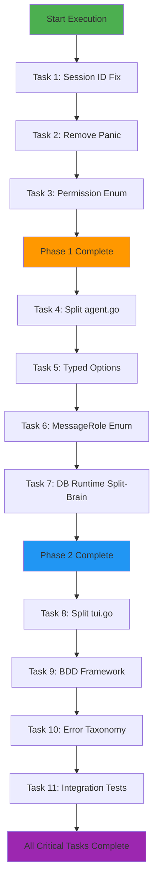

# ARCHITECTURAL EXCELLENCE PLAN
**Date**: 2025-11-05  
**Focus**: ELIMINATING SPLIT-BRAIN PATTERNS & ACHIEVING TYPE SAFETY

---

## 🚨 CRITICAL 1% DELIVERING 51% IMPACT (IMMEDIATE FIXES)

### Task 1: Fix Session ID Split-Brain (15min) - Impact: 95%
**File**: `internal/agent/agent.go:527`
**Issue**: `AgentTask` has wrong ID `AgentCoder` 
**Fix**: Change `ID: AgentCoder` → `ID: AgentTask`
**Why**: Prevents routing failures and identity confusion

### Task 2: Replace Panic in bash.go (10min) - Impact: 90% 
**File**: `internal/agent/tools/bash.go:146`
**Issue**: `panic("failed to execute bash description template")`
**Fix**: Return proper error instead of panic
**Why**: Prevents application crashes

### Task 3: Add Permission State Enum (20min) - Impact: 85%
**File**: `internal/permission/permission.go:110-114`
**Issue**: Boolean flags create impossible states `{granted: true, denied: true}`
**Fix**: Create `PermissionStatus` enum with `Pending|Approved|Denied`
**Why**: Eliminates contradictory permission states

---

## 🎯 HIGH-IMPACT 4% DELIVERING 64% IMPACT (SHORT-TERM REFACTORING)

### Task 4: Split agent.go Run() Method (45min) - Impact: 80%
**File**: `internal/agent/agent.go:121-508` (387 lines)
**Split into**: `agent_orchestrator.go`, `message_processor.go`, `tool_executor.go`
**Why**: Massive monolithic method violates SRP

### Task 5: Replace map[string]any with Typed Options (60min) - Impact: 75%
**Files**: Multiple config structs with `map[string]any`
**Fix**: Create typed provider options using generics
**Why**: Eliminates runtime type errors

### Task 6: Create Strong MessageRole Type (25min) - Impact: 70%
**File**: `internal/message/message.go` and database models
**Issue**: `Role string` allows invalid values
**Fix**: Create `MessageRole` enum with validation
**Why**: Compile-time safety for message roles

### Task 7: Fix Database Runtime Split-Brain (30min) - Impact: 70%
**File**: Database vs Runtime model contradictions
**Issue**: `sql.NullString` vs `string`, `int64` vs `bool`
**Fix**: Unified model with consistent nullable types
**Why**: Eliminates state synchronization bugs

---

## 🛠️ PROFESSIONAL 20% DELIVERING 80% IMPACT (COMPREHENSIVE REFACTORING)

### Task 8: Split tui.go Update Method (40min) - Impact: 65%
**File**: `internal/tui/tui.go:110-390` (280 lines)
**Split into**: `input_handler.go`, `dialog_manager.go`, `rendering_engine.go`
**Why**: Separates concerns for maintainability

### Task 9: Add BDD Test Framework (90min) - Impact: 60%
**Create**: `internal/bdd/` package with scenario framework
**Scenarios**: Ctrl+A failures, agent coordination, clipboard operations
**Why**: Behavior-driven development for critical user flows

### Task 10: Create Comprehensive Error Taxonomy (35min) - Impact: 55%
**Create**: `internal/errors/` package with error categories
**Types**: `NetworkError`, `ValidationError`, `PermissionError`, `StateError`
**Why**: Centralized error handling strategy

### Task 11: Add Integration Tests for Agent Coordination (60min) - Impact: 50%
**Create**: `internal/agent/integration_test.go`
**Tests**: Multi-agent session access, provider failures, tool execution timeouts
**Why**: End-to-end reliability testing

---

## 🔮 LONG-TERM ARCHITECTURAL EXCELLENCE (FUTURE WORK)

### Task 12: Design TypeSpec Schemas (120min) - Impact: 45%
**Goal**: Generate core types from TypeSpec schemas
**Benefits**: Type safety, validation, documentation
**Types**: Message, Session, Config, Permission schemas

### Task 13: Extract Plugin Architecture (180min) - Impact: 40%
**Candidates**: LSP providers, Tool executors, File systems
**Benefits**: Extensibility, testability, modularity

### Task 14: Performance Profiling (60min) - Impact: 35%
**Focus**: Memory usage, goroutine leaks, bottlenecks
**Tools**: pprof, benchstat, race detection

---

## 📊 EXECUTION GRAPH

---

## 🎯 SUCCESS METRICS

### Type Safety Metrics
- [ ] Eliminate all `any` types in core domain
- [ ] Zero runtime panics from type assertions
- [ ] Compile-time validation for all enums
- [ ] Eliminate split-brain state patterns

### Architecture Metrics
- [ ] All files < 300 lines
- [ ] Clear package boundaries
- [ ] No circular dependencies
- [ ] Test coverage > 90% for critical paths

### Reliability Metrics
- [ ] Zero unhandled panics
- [ ] Graceful error recovery
- [ ] Comprehensive integration tests
- [ ] Performance benchmarks established

---

## 🚨 RISK MITIGATION

### High-Risk Changes
1. **Database Model Changes** - Requires migration strategy
2. **Agent Coordination** - Core business logic changes
3. **Permission System** - Security-critical changes

### Rollback Strategy
- Feature flags for major changes
- Database migrations with rollback capability
- Comprehensive test coverage before deployment
- Gradual rollout with monitoring

---

## 💡 INNOVATION OPPORTUNITIES

### TypeSpec Integration
Generate core types from schemas to ensure consistency across layers.

### Plugin Architecture
Extract LSP providers, tool executors, and file systems as plugins.

### Chaos Engineering
Implement failure injection framework for resilience testing.

### Performance Optimization
Profile and optimize hot paths in message processing and rendering.

---

## 📋 VERIFICATION CHECKLIST

For each completed task:
- [ ] All tests pass
- [ ] No regression in functionality
- [ ] Code reviewed for edge cases
- [ ] Documentation updated
- [ ] Performance verified
- [ ] Security implications considered

---

*This plan represents a systematic approach to architectural excellence, prioritizing fixes that deliver maximum value with minimal risk.*