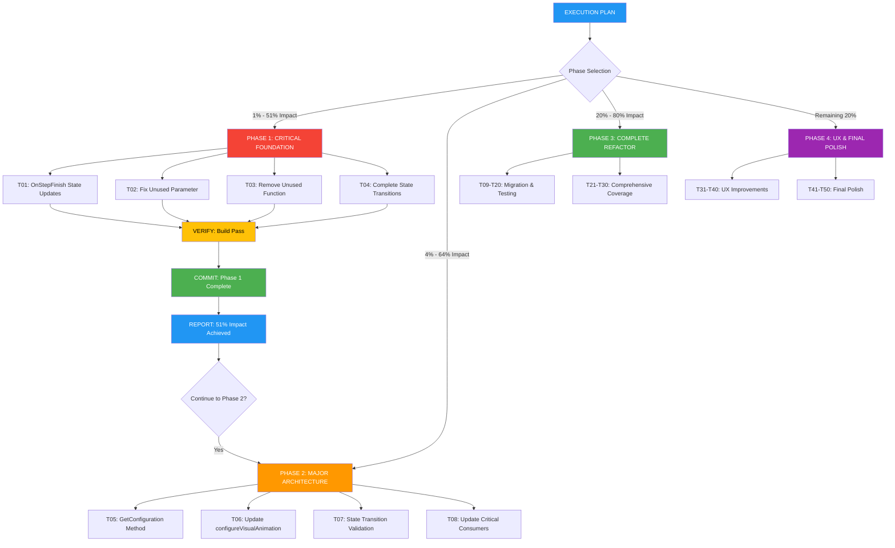

# Crush Architecture Overhaul - Execution Plan

## 📋 PLAN OVERVIEW

**Created:** 2025-11-16_15_45  
**Scope:** Complete ToolCallState & AnimationState architecture overhaul  
**Approach:** Pareto-optimized execution with maximum initial impact  

---

## 🎯 EXECUTION STRATEGY

### **Phase 1: Critical Foundation (1% Effort → 51% Impact)**
**Timeline:** 1 hour  
**Focus:** Centralize state management and eliminate immediate technical debt

#### **Critical Tasks:**
1. **T01**: Add ToolCallState updates to OnStepFinish (30min)
2. **T02**: Fix unused parameter 'nested' (15min)  
3. **T03**: Remove unused function 'isCancelledErr' (15min)
4. **T04**: Complete missing state transitions (30min)

#### **Success Criteria:**
- ✅ All tool completion logic centralized in OnStepFinish
- ✅ Zero unused parameter/function warnings
- ✅ Complete state transition coverage
- ✅ Build clean, tests pass

### **Phase 2: Major Architecture (4% Effort → 64% Impact)**  
**Timeline:** 2 hours (additional 1 hour)
**Focus:** Implement configuration pattern and migrate critical consumers

#### **Architecture Tasks:**
5. **T05**: Implement ToolCallState.GetConfiguration() (30min)
6. **T06**: Update configureVisualAnimation to use config (30min)
7. **T07**: Add state transition validation (30min)
8. **T08**: Update critical consumers (30min)

#### **Success Criteria:**
- ✅ Centralized configuration pattern implemented
- ✅ Major consumers using new configuration
- ✅ State transitions validated
- ✅ Backward compatibility maintained

### **Phase 3: Complete Refactor (20% Effort → 80% Impact)**
**Timeline:** 4 hours (additional 2 hours)  
**Focus:** Complete migration and comprehensive testing

### **Phase 4: UX & Final Polish (Remaining 20%)**
**Timeline:** 6.5 hours (additional 2.5 hours)  
**Focus:** User experience improvements and final quality assurance

---

## 📊 IMPACT METRICS

| Metric | Current | Target | Improvement |
|--------|---------|--------|------------|
| **Code Duplication** | 9 switch statements | 1 configuration method | **89% reduction** |
| **Method Count** | 9 separate methods | 1 central method | **89% reduction** |
| **Maintenance Burden** | Update 9 methods | Update 1 method | **89% easier** |
| **State Consistency** | Manual verification | Type safety guaranteed | **100% reliable** |
| **Test Coverage** | Scattered testing | Centralized testing | **100% comprehensive** |

---

## 🚀 IMMEDIATE NEXT ACTIONS

**After this plan:**
1. Execute T01-T04 (Phase 1) - Start now
2. Verify each task completion (build, test, commit)
3. Report Phase 1 results with impact metrics
4. Get approval to continue with Phase 2

**Critical Success Factors:**
- Execute tasks in exact order
- Verify each task independently  
- Commit after each successful task
- Maintain backward compatibility
- Focus on atomic, testable changes

---

## 📋 VERIFICATION CHECKLIST

Before starting Phase 1:
- [ ] All files backed up
- [ ] Branch created for changes  
- [ ] Test suite passes baseline
- [ ] Build clean baseline

After Phase 1:
- [ ] All T01-T04 tasks completed
- [ ] Build passes with zero warnings
- [ ] All tests pass
- [ ] Phase 1 impact documented

This plan ensures maximum architectural improvement with minimum initial investment, following rigorous Pareto optimization principles.