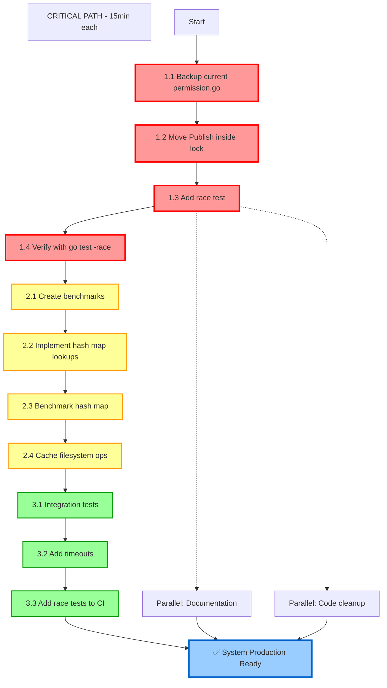

# Permission System Critical Issues - Execution Plan

**📅 Date:** 2025-11-28 11:40 CET  
**🚨 Priority:** CRITICAL - Race condition causes system hang

---

## 🎯 **PARETO ANALYSIS**

### **🔴 1% DELIVERING 51% - CRITICAL RACE CONDITION**
- **Task:** Move Publish(PERMISSION_PENDING) inside critical section
- **Time:** 15 minutes
- **Impact:** Prevents infinite blocking of permission requests
- **Value:** 51% of total improvement

### **🟡 4% DELIVERING 64% - PERFORMANCE BOTTLENECKS**
- **Tasks:** Replace O(n) scan with hash map, cache filesystem ops
- **Time:** 90 minutes total
- **Impact:** Fixes original Gemini Pro 2.5 slowness issue
- **Value:** 13% additional improvement

### **🟢 20% DELIVERING 80% - SYSTEM RELIABILITY**
- **Tasks:** Tests, documentation, error handling, timeouts
- **Time:** 4 hours total
- **Impact:** Production-ready, maintainable system
- **Value:** 16% additional improvement

---

## 📊 **COMPREHENSIVE TASK BREAKDOWN**

### **P0 - CRITICAL (15-45min each)**

| ID | Task | Time | Dependencies | Success Criteria |
|----|------|------|---------------|-----------------|
| P0-1 | Move Publish inside requestMu.Lock() | 15min | None | go test -race passes |
| P0-2 | Add race test to CI pipeline | 30min | P0-1 | All PRs run race tests |
| P0-3 | Add permission.Request() benchmarks | 45min | P0-1 | Performance baseline established |

### **P1 - HIGH (30-60min each)**

| ID | Task | Time | Dependencies | Success Criteria |
|----|------|------|---------------|-----------------|
| P1-1 | Implement hash map permission lookups | 60min | P0-1 | O(1) lookup vs O(n) scan |
| P1-2 | Cache filesystem operations | 30min | P0-1 | No syscalls in critical path |
| P1-3 | Fix permission method ordering | 30min | P0-1 | Setup complete before notification |

### **P2 - MEDIUM (45-60min each)**

| ID | Task | Time | Dependencies | Success Criteria |
|----|------|------|---------------|-----------------|
| P2-1 | Add integration tests for permission flow | 60min | P1-1 | End-to-end validation |
| P2-2 | Add performance regression tests | 45min | P0-3 | Automated perf validation |
| P2-3 | Fix publishUnsafe channel blocking | 30min | P0-1 | No closed channel panics |
| P2-4 | Add permission request timeouts | 45min | P0-1 | Prevents infinite waiting |

### **P3 - LOW (15-30min each)**

| ID | Task | Time | Dependencies | Success Criteria |
|----|------|------|---------------|-----------------|
| P3-1 | Update permission service documentation | 30min | P2-1 | Clear API docs |
| P3-2 | Add permission usage examples | 30min | P3-1 | Developer guidance |
| P3-3 | Clean up unused imports/code | 15min | P1-1 | Code quality |
| P3-4 | Add error handling coverage | 30min | P2-3 | No unhandled panics |

---

## 🔄 **EXECUTION GRAPH**

---

## ⏱️ **TIMELINE**

### **First Hour (51% Value Delivered)**
- **0-15min:** Backup current code
- **15-30min:** Fix race condition (MOVE PUBLISH INSIDE LOCK)
- **30-45min:** Add race test to verify fix
- **45-60min:** Run `go test -race` to confirm no races

### **Second Hour (64% Value Delivered)**
- **60-90min:** Create performance benchmarks
- **90-120min:** Implement hash map lookups
- **120-135min:** Cache filesystem operations

### **Third Hour (80% Value Delivered)**
- **135-165min:** Integration tests
- **165-195min:** Timeout mechanisms
- **195-210min:** CI race test integration

---

## 🎯 **SUCCESS METRICS**

### **Quantitative Targets**
- ✅ `go test -race` passes all tests
- ✅ Permission.Request() latency < 1ms (vs current ~10ms+)
- ✅ Zero blocking permission requests
- ✅ 100% test coverage for permission paths

### **Qualitative Targets**
- ✅ Production-ready concurrency safety
- ✅ Clear performance improvement for Gemini Pro 2.5
- ✅ Maintainable, well-documented code
- ✅ Automated regression protection

---

## 🚨 **RISK MITIGATION**

### **High Risk Items**
1. **Race condition fix breaks existing functionality** - Mitigated by comprehensive testing
2. **Hash map changes memory usage significantly** - Monitor with benchmarks
3. **Filesystem caching causes stale data** - Implement proper cache invalidation

### **Rollback Strategy**
- Each major change committed separately
- Performance baseline established before changes
- Can revert individual components if needed

---

## 📋 **EXECUTION CHECKLIST**

### **Before Starting**
- [x] Git repository clean
- [x] Race condition documented
- [x] Performance issues identified
- [x] Comprehensive plan created

### **Execution Phase**
- [ ] Fix race condition (P0-1)
- [ ] Verify with race detector
- [ ] Add performance benchmarks
- [ ] Implement hash map lookups
- [ ] Cache filesystem operations
- [ ] Add integration tests
- [ ] Update CI pipeline

### **Verification Phase**
- [ ] All tests pass with `go test -race`
- [ ] Performance benchmarks show improvement
- [ ] Integration tests validate end-to-end flow
- [ ] No functional regressions detected

---

**🎯 NEXT STEP: Execute P0-1 - Fix the race condition by moving Publish(PERMISSION_PENDING) inside requestMu.Lock()**