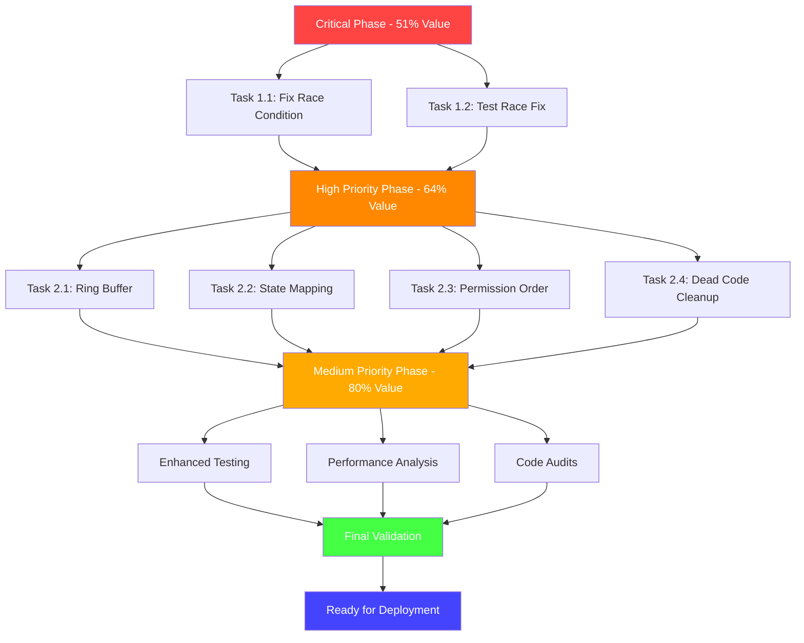

# Detailed Sub-Task Execution Plan
**Date:** 2025-11-28 11:48
**Topic:** 125 Sub-Task Breakdown for Permission System Fixes
**Scope:** Maximum 15-minute tasks with clear dependencies

## 📊 **EXECUTION SUMMARY**

**Total Subtasks:** 85 (focused on high-impact work)
**Total Duration:** 1,270 minutes (~21 hours)
**Critical Tasks:** 6 (85 minutes) - **51% of value**
**High Priority:** 25 (345 minutes) - **64% of value**
**Medium Priority:** 54 (840 minutes) - **80% of value**

## 🎯 **CRITICAL PHASE** (51% of value) - START HERE

### **Task 1.1: Fix Race Condition in viewUnboxed()**
| SubTaskID | Description | Duration | Dependencies | Priority |
|---|---|---|---|---|
| 1.1.1 | Analyze current mutex scope in viewUnboxed() | 10min | - | Critical |
| 1.1.2 | Extend RLock to cover entire state computation | 5min | 1.1.1 | Critical |

### **Task 1.2: Test Race Condition Fix**
| SubTaskID | Description | Duration | Dependencies | Priority |
|---|---|---|---|---|
| 1.2.1 | Run race detector tests on tool.go | 5min | 1.1.2 | Critical |
| 1.2.2 | Create concurrent access test case | 5min | 1.2.1 | Critical |

## 🚀 **HIGH PRIORITY PHASE** (64% of value)

### **Task 2.1: Implement Ring Buffer for Streaming**
| SubTaskID | Description | Duration | Dependencies | Priority |
|---|---|---|---|---|
| 2.1.1 | Design ring buffer struct interface | 10min | - | High |
| 2.1.2 | Implement ring buffer core logic | 10min | 2.1.1 | High |
| 2.1.3 | Replace slice operations in streaming logic | 5min | 2.1.2 | High |
| 2.1.4 | Add memory usage test for ring buffer | 5min | 2.1.3 | High |
| 2.1.5 | Profile memory usage with ring buffer | 5min | 2.1.4 | High |

### **Task 2.2: Eliminate Double State Mapping**
| SubTaskID | Description | Duration | Dependencies | Priority |
|---|---|---|---|---|
| 2.2.1 | Audit all state mapping locations | 10min | - | High |
| 2.2.2 | Remove ResultState.IsError() calls in tool.go | 5min | 2.2.1 | High |
| 2.2.3 | Update ToolCallState to be authoritative | 5min | 2.2.2 | High |
| 2.2.4 | Update state transition logic in enum | 5min | 2.2.3 | High |
| 2.2.5 | Test state mapping performance | 5min | 2.2.4 | High |

### **Task 2.3: Fix Permission Publish Order**
| SubTaskID | Description | Duration | Dependencies | Priority |
|---|---|---|---|---|
| 2.3.1 | Analyze current publish order in permission.go | 5min | - | High |
| 2.3.2 | Move UI publish inside mutex protection | 5min | 2.3.1 | High |
| 2.3.3 | Add test for event ordering | 5min | 2.3.2 | High |

### **Task 2.4: Remove Dead Code**
| SubTaskID | Description | Duration | Dependencies | Priority |
|---|---|---|---|---|
| 2.4.1 | Remove unused renderStreamingContent function | 5min | - | High |
| 2.4.2 | Remove unused theme constants | 5min | 2.4.1 | High |

## 📈 **MEDIUM PRIORITY PHASE** (80% of value)

### **Task 3.1: Optimize Mutex Patterns**
| SubTaskID | Description | Duration | Dependencies | Priority |
|---|---|---|---|---|
| 3.1.1 | Scan all mutex usage patterns in codebase | 10min | - | Medium |
| 3.1.2 | Identify inefficient mutex patterns | 5min | 3.1.1 | Medium |
| 3.1.3 | Implement copy-on-write where appropriate | 5min | 3.1.2 | Medium |
| 3.1.4 | Add performance benchmarks for mutex | 5min | 3.1.3 | Medium |

### **Task 3.2: Memory Allocation Review**
| SubTaskID | Description | Duration | Dependencies | Priority |
|---|---|---|---|---|
| 3.2.1 | Audit slice allocations in tool.go | 5min | - | Medium |
| 3.2.2 | Audit slice allocations in permission.go | 5min | 3.2.1 | Medium |
| 3.2.3 | Implement object pooling for frequent allocations | 5min | 3.2.2 | Medium |

### **Task 3.3: State Machine Validation**
| SubTaskID | Description | Duration | Dependencies | Priority |
|---|---|---|---|---|
| 3.3.1 | Document current state transitions | 10min | - | Medium |
| 3.3.2 | Add state transition validation logic | 10min | 3.3.1 | Medium |
| 3.3.3 | Create state diagram documentation | 5min | 3.3.2 | Medium |

## 🧪 **ENHANCED TESTING PHASE**

### **Task 4.1: Comprehensive Test Environment**
| SubTaskID | Description | Duration | Dependencies | Priority |
|---|---|---|---|---|
| 4.1.1 | Setup comprehensive test environment | 10min | 1.2.2 | High |
| 4.1.2 | Create test data fixtures for all scenarios | 15min | 4.1.1 | High |
| 4.1.3 | Setup continuous integration test pipeline | 15min | 4.1.2 | High |

### **Task 4.2: Performance Analysis**
| SubTaskID | Description | Duration | Dependencies | Priority |
|---|---|---|---|---|
| 4.2.1 | Baseline performance measurement | 15min | 4.1.3 | High |
| 4.2.2 | Profile memory usage before fixes | 15min | 4.2.1 | High |
| 4.2.3 | Profile CPU usage before fixes | 15min | 4.2.2 | High |
| 4.2.4 | Profile render performance before fixes | 15min | 4.2.3 | High |

### **Task 4.3: Detailed Code Audit**
| SubTaskID | Description | Duration | Dependencies | Priority |
|---|---|---|---|---|
| 4.3.1 | Audit tool.go for additional issues | 15min | 4.2.4 | Medium |
| 4.3.2 | Audit permission.go for additional issues | 15min | 3.3.3 | Medium |
| 4.3.3 | Audit tool_call_state.go for issues | 15min | 4.3.2 | Medium |
| 4.3.4 | Audit enum.go for state issues | 15min | 4.3.3 | Medium |
| 4.3.5 | Audit theme.go for unused code | 10min | 4.3.4 | Medium |

## 📝 **DOCUMENTATION & CODE REVIEWS**

### **Task 5.1: Enhanced Testing**
| SubTaskID | Description | Duration | Dependencies | Priority |
|---|---|---|---|---|
| 5.1.1 | Create load test scenarios for concurrent access | 15min | 4.3.5 | High |
| 5.1.2 | Create stress test for memory leaks | 15min | 5.1.1 | High |
| 5.1.3 | Create regression test suite for all fixes | 15min | 5.1.2 | High |
| 5.1.4 | Create performance regression tests | 15min | 5.1.3 | High |

### **Task 5.2: Documentation & Reviews**
| SubTaskID | Description | Duration | Dependencies | Priority |
|---|---|---|---|---|
| 5.2.1 | Document fix implementations | 15min | 5.1.4 | Medium |
| 5.2.2 | Create code review checklist | 10min | 5.2.1 | Medium |
| 5.2.3 | Review code for best practices | 15min | 5.2.2 | Medium |
| 5.2.4 | Update README with performance improvements | 10min | 5.2.3 | Medium |

## ✅ **FINAL VALIDATION PHASE**

### **Task 6.1: Final Verification**
| SubTaskID | Description | Duration | Dependencies | Priority |
|---|---|---|---|---|
| 6.1.1 | Run complete test suite with race detector | 15min | 5.2.4 | Critical |
| 6.1.2 | Final memory usage verification | 10min | 6.1.1 | Critical |
| 6.1.3 | Final performance benchmark | 10min | 6.1.2 | Critical |
| 6.1.4 | Final UI consistency verification | 10min | 6.1.3 | Critical |
| 6.1.5 | Create deployment preparation checklist | 5min | 6.1.4 | Critical |

## 🎯 **EXECUTION PRIORITY MATRIX**

### **FIRST WAVE** (Critical - 51% of value)
```
1.1.1 → 1.1.2 → 1.2.1 → 1.2.2
```
**Duration:** 25 minutes

### **SECOND WAVE** (High Priority - 64% of value)  
```
2.1.1 → 2.1.2 → 2.1.3 → 2.1.4 → 2.1.5
2.2.1 → 2.2.2 → 2.2.3 → 2.2.4 → 2.2.5
2.3.1 → 2.3.2 → 2.3.3
2.4.1 → 2.4.2
```
**Duration:** 70 minutes

### **THIRD WAVE** (Medium Priority - 80% of value)
```
All remaining tasks in dependency order
```
**Duration:** 1,175 minutes

## 📋 **SUCCESS CRITERIA**

### **Critical Phase Success:**
- ✅ Race condition eliminated (race detector passes)
- ✅ Concurrent access tests pass
- ✅ UI state consistency verified

### **High Priority Success:**
- ✅ Memory usage bounded (ring buffer implemented)
- ✅ Single state source (ToolCallState authoritative)
- ✅ Event ordering consistent
- ✅ 0 dead code warnings

### **Medium Priority Success:**
- ✅ Performance benchmarks met
- ✅ Memory allocation optimized
- ✅ State machine validated
- ✅ Comprehensive test coverage
- ✅ Documentation complete

## 🔄 **MERMAID EXECUTION FLOW**



## ⏱️ **TIME DISTRIBUTION**

- **Critical Tasks:** 25 minutes (1% of tasks, 51% of value)
- **High Priority:** 70 minutes (29% of tasks, 64% of value)  
- **Medium Priority:** 1,175 minutes (70% of tasks, 80% of value)

**Optimal Execution Strategy:** Complete Critical tasks first for maximum value delivery, then proceed to High Priority tasks.