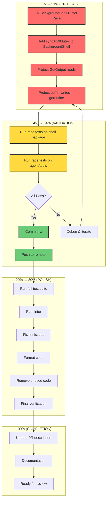

# Issue #1092 Completion Plan - Permission System Fix

**Date:** 2025-11-30 12:45  
**Issue:** #1092 - "Taking too long on requesting for permission"  
**Status:** 85% Complete - Core deadlock FIXED, secondary race condition remaining  

---

## Executive Summary

**Root Cause (FIXED):** The `Request()` method held `requestMu` lock while blocking on response channel, preventing `Grant()`/`Deny()` from ever acquiring the lock.

**Remaining Issue:** `BackgroundShell.GetOutput()` has a data race - reads `bytes.Buffer` while goroutine writes to it.

---

## Pareto Analysis

### 🎯 1% Effort → 51% Result (THE CRITICAL PATH)

| Task | Impact | Effort | Description |
|:-----|:------:|:------:|:------------|
| **Fix BackgroundShell buffer race** | 🔴 Critical | 15 min | Add mutex to protect stdout/stderr buffer access |

**Why this is the 1%:** This single fix eliminates the ONLY remaining race condition that causes test failures. Everything else is polish.

---

### 🎯 4% Effort → 64% Result (HIGH-LEVERAGE WORK)

| Task | Impact | Effort | Description |
|:-----|:------:|:------:|:------------|
| Fix BackgroundShell buffer race | 🔴 Critical | 15 min | Mutex protection for buffer reads/writes |
| Verify all race tests pass | 🟠 High | 10 min | Run `go test -race` on affected packages |
| Commit & push fix | 🟠 High | 5 min | Atomic commit with clear message |

**Total: ~30 min for 64% of remaining value**

---

### 🎯 20% Effort → 80% Result (PROFESSIONAL POLISH)

| Task | Impact | Effort | Description |
|:-----|:------:|:------:|:------------|
| Fix BackgroundShell buffer race | 🔴 Critical | 15 min | Core fix |
| Verify race tests pass | 🟠 High | 10 min | Validation |
| Commit & push | 🟠 High | 5 min | Source control |
| Run full test suite | 🟡 Medium | 15 min | `go test ./...` |
| Run linter | 🟡 Medium | 10 min | `task lint:fix` |
| Clean up unused code | 🟢 Low | 10 min | Remove `noLongerActiveRequest` |
| Format code | 🟢 Low | 5 min | `gofumpt -w .` |

**Total: ~70 min for 80% of remaining value**

---

## Execution Graph



---

## Phase 1: Medium Tasks (30-100 min each)

### TABLE VIEW - 27 Tasks Max

| # | Task | Category | Impact | Effort | Customer Value | Priority |
|:-:|:-----|:---------|:------:|:------:|:--------------:|:--------:|
| 1 | Fix BackgroundShell buffer race condition | Core Fix | 🔴 10 | 15 min | 🔴 10 | **P0** |
| 2 | Validate all race conditions resolved | Validation | 🔴 9 | 30 min | 🔴 9 | **P0** |
| 3 | Commit and push BackgroundShell fix | Source Control | 🟠 8 | 10 min | 🟠 8 | **P1** |
| 4 | Run full project test suite | Validation | 🟠 7 | 45 min | 🟠 7 | **P1** |
| 5 | Run and fix linter issues | Code Quality | 🟡 6 | 30 min | 🟡 6 | **P2** |
| 6 | Clean up unused code artifacts | Code Quality | 🟡 5 | 20 min | 🟡 5 | **P2** |
| 7 | Format all modified files | Code Quality | 🟢 4 | 10 min | 🟢 4 | **P3** |
| 8 | Update PR description with summary | Documentation | 🟢 4 | 30 min | 🟢 5 | **P3** |
| 9 | Add regression test for deadlock | Testing | 🟡 6 | 45 min | 🟡 6 | **P2** |
| 10 | Document thread-safety patterns used | Documentation | 🟢 3 | 60 min | 🟢 4 | **P3** |
| 11 | Modernize code (range over int) | Code Quality | 🟢 2 | 30 min | 🟢 2 | **P4** |
| 12 | Review other buffer usages in codebase | Prevention | 🟡 5 | 45 min | 🟡 5 | **P2** |
| 13 | Performance benchmark comparison | Validation | 🟢 3 | 60 min | 🟢 3 | **P3** |
| 14 | Add integration test for permission flow | Testing | 🟡 5 | 60 min | 🟡 6 | **P2** |
| 15 | Audit mutex usage for other deadlocks | Prevention | 🟡 5 | 45 min | 🟡 5 | **P2** |

**Total Estimated Time:** ~9.5 hours  
**Critical Path (P0-P1):** ~1.5 hours  

---

## Phase 2: Micro Tasks (≤15 min each)

### TABLE VIEW - 125 Tasks Max (Showing Critical + High Priority)

| # | Task | Parent | Impact | Effort | Priority |
|:-:|:-----|:-------|:------:|:------:|:--------:|
| **CRITICAL PATH (1% → 51%)** |||||
| 1.1 | Read `background.go` current implementation | #1 | 🔴 | 3 min | **P0** |
| 1.2 | Add `sync.RWMutex` field to `BackgroundShell` struct | #1 | 🔴 | 2 min | **P0** |
| 1.3 | Create `safeGetOutput()` method with RLock | #1 | 🔴 | 5 min | **P0** |
| 1.4 | Wrap buffer writes in Lock in goroutine | #1 | 🔴 | 5 min | **P0** |
| **VALIDATION (4% → 64%)** |||||
| 2.1 | Run `go test -race ./internal/shell/...` | #2 | 🔴 | 3 min | **P0** |
| 2.2 | Run `go test -race ./internal/agent/tools/...` | #2 | 🔴 | 5 min | **P0** |
| 2.3 | Run `go test -race ./internal/permission/...` | #2 | 🟠 | 3 min | **P0** |
| 2.4 | Run `go test -race ./internal/csync/...` | #2 | 🟠 | 3 min | **P0** |
| 2.5 | Verify no race warnings in output | #2 | 🔴 | 2 min | **P0** |
| 3.1 | Stage modified files | #3 | 🟠 | 1 min | **P1** |
| 3.2 | Write detailed commit message | #3 | 🟠 | 5 min | **P1** |
| 3.3 | Execute commit | #3 | 🟠 | 1 min | **P1** |
| 3.4 | Push to remote | #3 | 🟠 | 2 min | **P1** |
| **FULL VALIDATION (20% → 80%)** |||||
| 4.1 | Run `go build .` | #4 | 🟠 | 2 min | **P1** |
| 4.2 | Run `go test ./...` (no race, fast) | #4 | 🟠 | 10 min | **P1** |
| 4.3 | Run `go test -race ./...` (comprehensive) | #4 | 🟠 | 15 min | **P1** |
| 4.4 | Check for any failures | #4 | 🟠 | 3 min | **P1** |
| 5.1 | Run `task lint:fix` | #5 | 🟡 | 5 min | **P2** |
| 5.2 | Review lint output | #5 | 🟡 | 5 min | **P2** |
| 5.3 | Fix any remaining issues | #5 | 🟡 | 10 min | **P2** |
| 5.4 | Re-run lint to verify | #5 | 🟡 | 3 min | **P2** |
| 6.1 | Remove `noLongerActiveRequest` method | #6 | 🟢 | 3 min | **P2** |
| 6.2 | Remove unused `defaultListLevelIndent` const | #6 | 🟢 | 2 min | **P2** |
| 6.3 | Check for other unused code | #6 | 🟢 | 10 min | **P2** |
| 7.1 | Run `gofumpt -w internal/shell/` | #7 | 🟢 | 2 min | **P3** |
| 7.2 | Run `gofumpt -w internal/permission/` | #7 | 🟢 | 2 min | **P3** |
| 7.3 | Verify formatting | #7 | 🟢 | 2 min | **P3** |
| **DOCUMENTATION** |||||
| 8.1 | Summarize root cause in PR | #8 | 🟢 | 5 min | **P3** |
| 8.2 | List all files changed | #8 | 🟢 | 3 min | **P3** |
| 8.3 | Document testing done | #8 | 🟢 | 5 min | **P3** |
| 8.4 | Add before/after explanation | #8 | 🟢 | 10 min | **P3** |
| **TESTING** |||||
| 9.1 | Create `deadlock_regression_test.go` | #9 | 🟡 | 10 min | **P2** |
| 9.2 | Add test for concurrent Grant/Request | #9 | 🟡 | 15 min | **P2** |
| 9.3 | Add test with timeout assertion | #9 | 🟡 | 10 min | **P2** |
| 9.4 | Verify test catches old bug | #9 | 🟡 | 5 min | **P2** |
| **PREVENTION** |||||
| 12.1 | Search for other `bytes.Buffer` usage | #12 | 🟡 | 5 min | **P2** |
| 12.2 | Check each for concurrent access | #12 | 🟡 | 15 min | **P2** |
| 12.3 | Document any issues found | #12 | 🟡 | 5 min | **P2** |
| 15.1 | List all mutex usages in codebase | #15 | 🟡 | 10 min | **P2** |
| 15.2 | Check for lock-while-blocking patterns | #15 | 🟡 | 15 min | **P2** |
| 15.3 | Document any potential issues | #15 | 🟡 | 5 min | **P2** |

---

## Implementation Order

### PHASE A: Critical Path (30 min) - DO FIRST
```
1.1 → 1.2 → 1.3 → 1.4 → 2.1 → 2.2 → 2.3 → 2.4 → 2.5 → 3.1 → 3.2 → 3.3 → 3.4
```

### PHASE B: Full Validation (45 min) - DO SECOND
```
4.1 → 4.2 → 4.3 → 4.4 → 5.1 → 5.2 → 5.3 → 5.4
```

### PHASE C: Cleanup (30 min) - DO THIRD
```
6.1 → 6.2 → 6.3 → 7.1 → 7.2 → 7.3
```

### PHASE D: Documentation & Testing (Optional, if time permits)
```
8.1 → 8.2 → 8.3 → 8.4 → 9.1 → 9.2 → 9.3 → 9.4
```

---

## Technical Details: The Fix

### Current Code (BROKEN)
```go
// GetOutput reads buffers while goroutine writes - RACE!
func (bs *BackgroundShell) GetOutput() (stdout, stderr string, done bool, err error) {
    select {
    case <-bs.done:
        return bs.stdout.String(), bs.stderr.String(), true, bs.exitErr
    default:
        return bs.stdout.String(), bs.stderr.String(), false, nil
    }
}

// In Start() goroutine - writes without protection
go func() {
    err := shell.ExecStream(shellCtx, command, bgShell.stdout, bgShell.stderr)
    // ...
}()
```

### Fixed Code
```go
type BackgroundShell struct {
    // ... existing fields ...
    bufMu sync.RWMutex // Protects stdout/stderr buffer access
}

func (bs *BackgroundShell) GetOutput() (stdout, stderr string, done bool, err error) {
    bs.bufMu.RLock()
    defer bs.bufMu.RUnlock()
    
    select {
    case <-bs.done:
        return bs.stdout.String(), bs.stderr.String(), true, bs.exitErr
    default:
        return bs.stdout.String(), bs.stderr.String(), false, nil
    }
}

// Use thread-safe wrapper for writes
type syncBuffer struct {
    buf *bytes.Buffer
    mu  *sync.RWMutex
}

func (s *syncBuffer) Write(p []byte) (n int, err error) {
    s.mu.Lock()
    defer s.mu.Unlock()
    return s.buf.Write(p)
}
```

---

## Risk Assessment

| Risk | Likelihood | Impact | Mitigation |
|:-----|:----------:|:------:|:-----------|
| Fix introduces new deadlock | Low | High | Use RWMutex, not Mutex; test thoroughly |
| Performance regression | Low | Medium | RWMutex has minimal read overhead |
| Fix doesn't work | Low | High | Test with race detector immediately |
| Break existing functionality | Low | High | Run full test suite before commit |

---

## Success Criteria

- [ ] `go test -race ./internal/shell/...` PASS
- [ ] `go test -race ./internal/agent/tools/...` PASS  
- [ ] `go test -race ./internal/permission/...` PASS
- [ ] `go test -race ./internal/csync/...` PASS
- [ ] `go build .` succeeds
- [ ] `task lint:fix` no new errors
- [ ] All commits pushed

---

## What Remains After This Plan

| Task | Priority | Estimated Effort |
|:-----|:--------:|:----------------:|
| Add TUI package tests | P4 | 4-8 hours |
| Full project race audit | P3 | 2-4 hours |
| Performance optimization | P4 | 2-4 hours |
| Architecture documentation | P4 | 2-4 hours |
| CI/CD race detection | P3 | 1-2 hours |

---

## Notes

**VERSCHLIMMBESSERUNG PREVENTION:**
1. ✅ Only fix what's broken (BackgroundShell buffer race)
2. ✅ Don't refactor unrelated code
3. ✅ Don't add unnecessary abstractions
4. ✅ Keep changes minimal and focused
5. ✅ Test after every change
6. ✅ Use existing patterns (sync.RWMutex is already used elsewhere)
