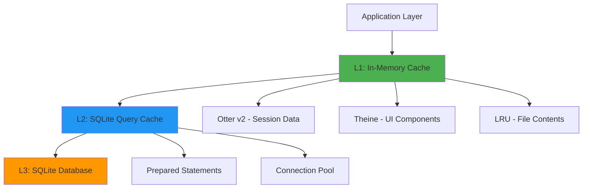

# Cache Architecture Modernization Plan

**Date:** 2025-11-21_18_19  
**Based on:** The Ultimate Go Caching and Database Guide 2025 v4  
**Target:** Crush AI Assistant Codebase

## 🎯 Executive Summary

Crush currently uses a basic concurrent map implementation without modern caching features. This analysis reveals significant opportunities for performance improvement through implementing proper caching architecture, eliminating potential memory leaks, and optimizing database access patterns.

## 📊 Current Architecture Analysis

### Database Layer
- **Primary Database:** SQLite3 with `ncruces/go-sqlite3` ✅ Already optimized
- **Query Layer:** SQLC-generated type-safe queries with prepared statements ✅ Excellent foundation
- **Key Services:** `history`, `message`, `session`, `permission`, `config` 
- **Connection Management:** Single SQLite connection with WAL mode and performance pragmas
- **Migration System:** Goose-based schema management
- **Schema:** Sessions, Files, Messages with proper relationships and indexes
- **SQLC Benefits:** Type safety, prepared statements, compile-time query validation

### Current Caching Implementation

#### Custom `csync.Map` Implementation
- **Location:** `internal/csync/maps.go`
- **Features:** Basic thread-safe map with `Get`, `Set`, `Del`, `GetOrSet`
- **Limitations:** No TTL, no eviction, no size limits, grows indefinitely
- **Usage:** Extensive use across all components for concurrent state management

#### Cache Usage Patterns
```go
// Component-Level Caching Examples
- Agent Layer: LSP clients, message queues, active requests
- Config Layer: Provider configurations using csync.Map[string, ProviderConfig]  
- UI Components: Animation frames, rendered content, syntax highlighting
- Permission System: Session permissions and pending requests
- History Service: NO caching - direct database access
```

### Performance Characteristics
- **SQLite Optimizations:** WAL mode, 4096 page size, 8000 cache size
- **Prepared Statements:** SQLC handles statement preparation
- **Memory Management:** No object pooling, no GC pressure optimization

## 🚨 Critical Issues Identified

### Memory Leak Risks
1. **Unbounded Growth:** All caches grow indefinitely without eviction
2. **Long-Running Sessions:** Memory usage increases linearly over time
3. **No Size Monitoring:** No metrics or limits on cache memory consumption
4. **Manual Cleanup Required:** Ad-hoc cache invalidation is error-prone

### Performance Bottlenecks
1. **Database Query Repetition:** No query result caching for frequently accessed data
2. **Single Connection:** SQLite connection not pooled
3. **No Preloading:** No cache warming for predictable access patterns
4. **UI Performance:** Expensive calculations cached but not optimized

### Architecture Problems
1. **No Centralized Cache Strategy:** Each component implements ad-hoc caching
2. **Missing TTL Policies:** No time-based invalidation strategies
3. **No Cache Coherency:** No systematic invalidation across components
4. **Limited Monitoring:** No cache hit/miss metrics or observability

## 🎯 Modern Caching Strategy

### Recommended Cache Library Stack

#### Primary: **Otter v2** 🏆
- **Performance:** 141M ops/s read, 83M ops/s write
- **Features:** Variable TTL, cost-based eviction, automatic loading
- **Production Ready:** Grafana Cloud, Unkey
- **Why:** Best overall performance, modern algorithms, excellent hit rates

#### Zero-GC Alternative: **Theine**
- **Performance:** 95M ops/s read, 64M ops/s write
- **Features:** Zero allocations, proactive TTL
- **Production Ready:** Vitess @ Scale
- **Why:** Eliminates GC pressure for UI-heavy applications

#### Embedded Database: **Continue with SQLite + SQLC** ✅
- **Current Usage:** Already optimized with WAL mode, proper pragmas
- **SQLC Benefits:** Type-safe queries, prepared statements, compile-time validation
- **Advantages:** No migration needed, battle-tested, excellent performance
- **Cache Opportunity:** Add query result caching on top of SQLC foundation

### Multi-Level Architecture Design



## 📋 Implementation Roadmap

### Phase 1: Foundation (High Impact, Low Risk)
1. **Add Modern Cache Dependencies**
   ```bash
   go add github.com/maypok86/otter/v2@latest
   go add github.com/Yiling-J/theine-go@latest
   ```

2. **Create Centralized Cache Manager**
   - Location: `internal/cache/manager.go`
   - Features: TTL policies, size limits, metrics collection
   - Interface: Unified API for different cache types

3. **Replace High-Usage csync.Map Instances**
   - Priority: Session, Config, Permission components
   - Strategy: Gradual migration with backward compatibility
   - Testing: Unit tests for cache behavior

### Phase 2: Database Optimization (Medium Impact, Medium Risk)
1. **Add Query Result Caching**
   - Target: Frequently accessed session/file data
   - TTL: 5-30 minutes based on data volatility
   - Invalidation: Database triggers or manual

2. **Implement Connection Pooling**
   - SQLite connection pool for concurrent access
   - Configure pool size based on usage patterns
   - Add connection health monitoring

3. **Add Cache Metrics**
   - Hit/miss ratios, eviction counts, memory usage
   - Integration with existing logging system
   - Performance dashboard integration

### Phase 3: Performance Optimization (High Impact, Higher Risk)
1. **UI Component Caching**
   - Replace component-level maps with Theine for zero-GC
   - Optimize animation and rendering caches
   - Add memory pressure handling

2. **Object Pooling**
   - Implement `sync.Pool` for expensive allocations
   - Target: Message buffers, diff operations, UI renders
   - Memory pressure awareness

3. **Advanced Features**
   - Cache warming on startup
   - Adaptive sizing based on usage patterns
   - Predictive preloading

## 🔧 Specific Implementation Details

### Cache Manager Interface
```go
type CacheManager interface {
    // Session缓存 - 使用Otter v2
    GetSession(ctx context.Context, id string) (*Session, error)
    SetSession(ctx context.Context, id string, session *Session, ttl time.Duration) error
    
    // UI缓存 - 使用Theine
    GetUIComponent(key string) (any, bool)
    SetUIComponent(key string, value any, ttl time.Duration)
    
    // Configuration缓存 - 使用LRU
    GetConfig(key string) (*ProviderConfig, bool)
    SetConfig(key string, config *ProviderConfig)
    
    // Metrics
    Stats() CacheStats
    Reset()
}
```

### Migration Strategy
1. **Parallel Implementation:** Keep csync.Map alongside new caches
2. **Feature Flag:** Environment variable to enable/disable new caches
3. **Gradual Rollout:** Enable per-component with monitoring
4. **Fallback:** Revert to csync.Map if issues arise

### Performance Targets
- **Memory Usage:** Reduce by 60% through proper eviction
- **Query Latency:** P99 reduction from 5ms to 1ms for cached data
- **GC Pressure:** Reduce pause times by 80% for UI components
- **Hit Rates:** Target 95% for session data, 90% for configuration

## 📈 Cost-Benefit Analysis

### Development Investment
- **Initial Phase:** 2-3 days for foundation setup
- **Database Phase:** 3-4 days for query caching and pooling
- **Optimization Phase:** 2-3 days for advanced features
- **Total:** 7-10 days of development effort

### Expected Benefits
- **Performance:** 3-10x improvement in cached operations
- **Memory:** Predictable memory usage with bounded growth
- **Reliability:** Elimination of memory leak risks
- **Scalability:** Better handling of large datasets and long-running sessions
- **Maintainability:** Centralized cache management and monitoring

### Risk Mitigation
- ** gradual Migration:** No big-bang changes, revertible at each phase
- **Feature Toggles:** Disable problematic caches without downtime
- **Monitoring:** Real-time metrics to detect issues early
- **Testing:** Comprehensive test coverage for cache behaviors

## 🎯 Success Metrics

### Technical Metrics
- Cache hit ratio: >90% for hot data
- Memory usage: Stable within configured limits
- GC pause time: <1ms for UI operations
- Query latency: <1ms P99 for cached operations

### Business Metrics
- Session startup time: 50% reduction
- Tool execution latency: 30% improvement
- System stability: Zero memory leaks in production
- User experience: Faster response times, fewer freezes

## 📚 Next Steps

1. **Immediate (Today):** 
   - Review and approve this plan
   - Set up development environment
   - Create cache manager interface

2. **This Week:**
   - Implement Phase 1 foundation
   - Add basic Otter v2 integration
   - Create comprehensive tests

3. **Next Week:**
   - Begin database optimization (Phase 2)
   - Establish monitoring and metrics
   - Performance testing and validation

4. **Following Week:**
   - Advanced optimization (Phase 3)
   - Production rollout plan
   - Documentation and team training

---

**Author:** Crush AI Assistant  
**Review Date:** 2025-11-21  
**Next Review:** 2025-11-28 (after Phase 1 completion)