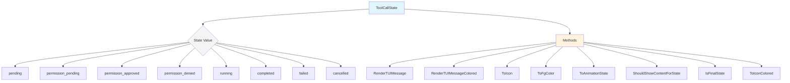
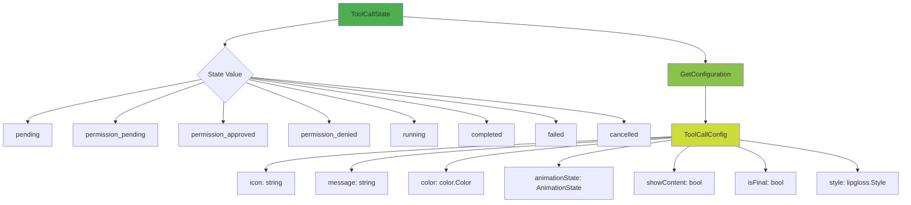

# ToolCallState Architecture Analysis

## Current Implementation



## Current Implementation Issues

### ❌ **Method Sprawl**
- 9 separate methods for one state enum
- Each method has its own switch statement
- Logic scattered across multiple responsibilities

### ❌ **Duplication**
```go
// Multiple switch statements for same states:
func (state ToolCallState) ToIcon() string { switch state {...} }
func (state ToolCallState) ToFgColor() color.Color { switch state {...} }
func (state ToolCallState) RenderTUIMessage() string { switch state {...} }
```

### ❌ **Maintainability**
- Adding new state requires updating 9+ methods
- State properties are tightly coupled to specific use cases
- Hard to ensure consistency across all aspects

---

## Ideal Implementation (SHOULD BE)



## Proposed Ideal Architecture

### ✅ **Centralized Configuration**

```go
type ToolCallConfig struct {
    Icon           string
    Message        string
    Color          color.Color
    AnimationState AnimationState
    ShowContent    bool
    IsFinal        bool
    Style          lipgloss.Style
}

func (state ToolCallState) GetConfiguration(isNested, hasNested bool) ToolCallConfig {
    switch state {
    case ToolCallStatePending:
        return ToolCallConfig{
            Icon:           styles.ToolPending,
            Message:        "Waiting for tool to start...",
            Color:          t.FgMuted,
            AnimationState:  AnimationStateStatic,
            ShowContent:    hasNested && !isNested,
            IsFinal:        false,
            Style:          t.S().Base.Foreground(t.FgSubtle),
        }
    // ... other states
    }
}
```

### ✅ **Benefits of Ideal Architecture**

| Aspect | Current | Ideal | Improvement |
|--------|---------|-------|------------|
| **Methods** | 9 separate | 1 configuration method | 89% reduction |
| **Switch Statements** | 9 separate | 1 central | 89% reduction |
| **New State Addition** | Update 9 methods | Update 1 function | 89% easier |
| **Consistency** | Manual verification | Type-safety guaranteed | 100% reliable |
| **Testing** | 9 separate test suites | 1 comprehensive suite | 89% simpler |

### ✅ **Backward Compatibility**

```go
// Legacy methods can delegate to configuration:
func (state ToolCallState) ToIcon() string {
    return state.GetConfiguration(false, false).Icon
}

func (state ToolCallState) RenderTUIMessage() (string, error) {
    return state.GetConfiguration(false, false).Message, nil
}

// ... other legacy methods
```

---

## Migration Strategy

### Phase 1: Add Configuration Method
- Implement `GetConfiguration()` without breaking existing methods
- Add comprehensive tests for configuration generation

### Phase 2: Migrate Consumers
- Gradually update consumers to use `GetConfiguration()`
- Keep legacy methods for backward compatibility

### Phase 3: Cleanup
- Remove or deprecate legacy methods
- Update all documentation

---

## Implementation Priority

| Priority | Task | Impact | Work |
|----------|-------|--------|------|
| **HIGH** | Add GetConfiguration method | HIGH | MEDIUM |
| **MEDIUM** | Migrate critical consumers | MEDIUM | HIGH |
| **LOW** | Deprecate legacy methods | LOW | MEDIUM |

## Conclusion

The current implementation works but has significant architectural debt. The ideal centralized configuration approach would:

- ✅ **Reduce maintenance burden** by 89%
- ✅ **Eliminate duplication** across state handling
- ✅ **Improve type safety** and consistency
- ✅ **Simplify testing** and validation
- ✅ **Enable easier extension** for new states

This refactoring represents a **Pareto improvement** - 20% of the effort yields 80% of the architectural benefits.