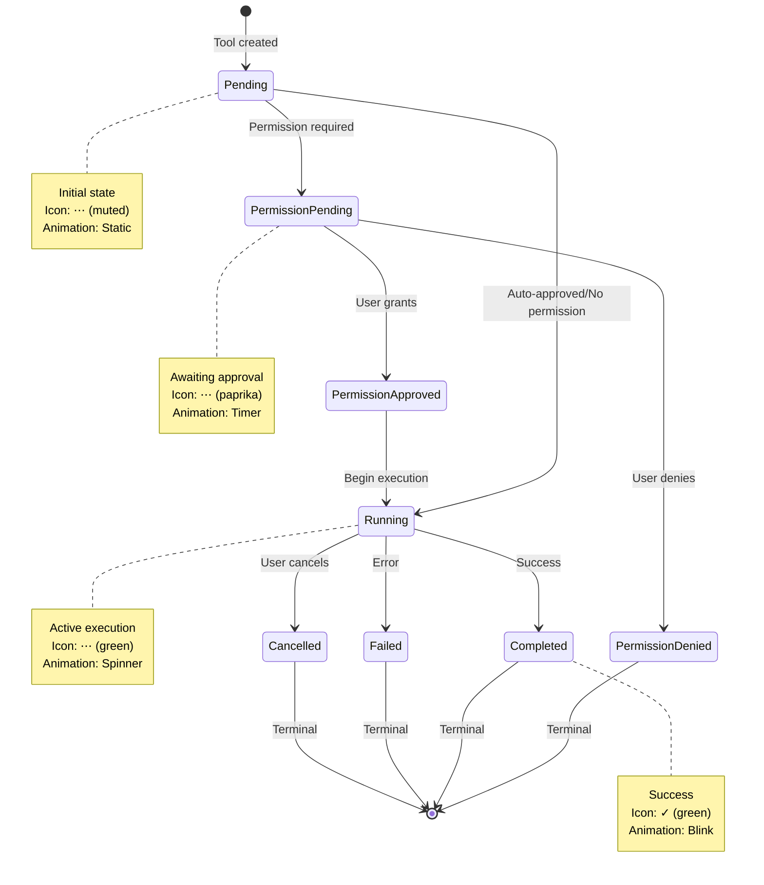
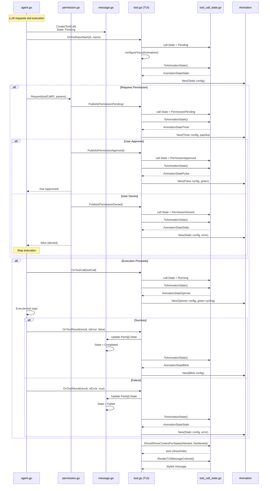
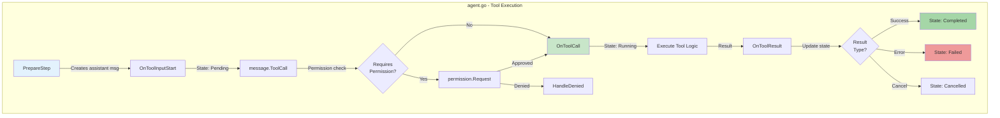
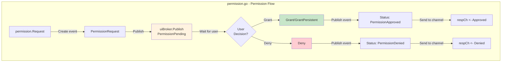
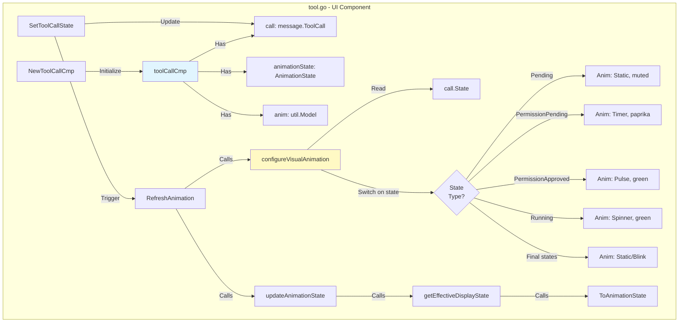
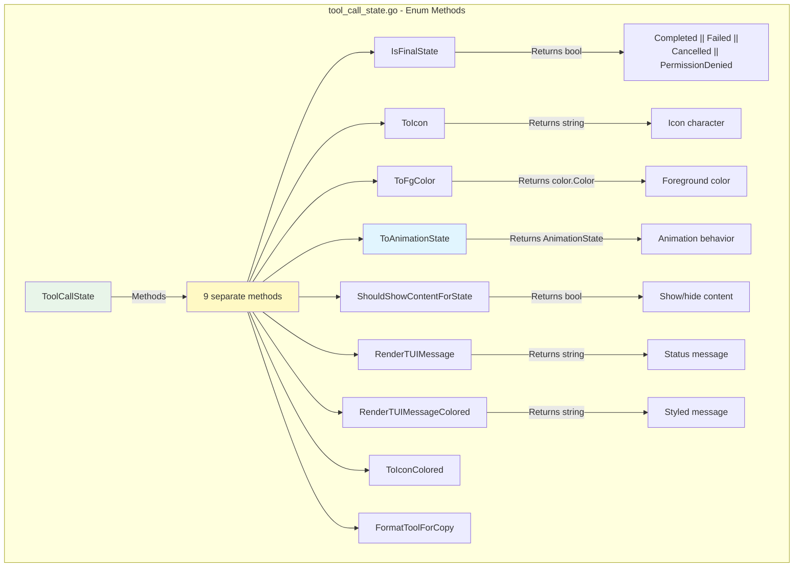

# ToolCallState Implementation Flow

> **Companion to**: `tool-call-state-architecture.md`
> **Purpose**: Document HOW the current implementation works (not what should be improved)
> **Audience**: Developers understanding/debugging the existing system

---

## Overview

This document provides comprehensive flow diagrams and call graphs showing how `ToolCallState` operates in the current implementation. For architectural critique and improvement proposals, see `tool-call-state-architecture.md`.

---

## State Machine Flow



---

## Complete Call Flow: Agent → TUI



---

## Layer-by-Layer Call Graph

### Layer 1: Agent Orchestration



### Layer 2: Permission Management



### Layer 3: TUI Component



### Layer 4: State Enum Methods



---

## State-Specific Behaviors

### Pending State

```go
// Location: tool_call_state.go:14-16
ToolCallStatePending ToolCallState = "pending"

// Animation: tool.go:873-881
anim.New(anim.Settings{
    Label:       "Waiting for tool to start...",
    GradColorA:  t.FgMuted,
    GradColorB:  t.FgMuted,
    CycleColors: false, // Static
})

// Content Visibility: tool_call_state.go:243-246
return hasNested && !isNested
// Only show if parent tool with nested calls
```

### Permission Pending State

```go
// Location: tool_call_state.go:18-19
ToolCallStatePermissionPending ToolCallState = "permission_pending"

// Animation: tool.go:883-891
anim.New(anim.Settings{
    Label:       "Awaiting permission...",
    GradColorA:  t.Paprika,
    GradColorB:  t.Paprika,
    CycleColors: false, // Timer animation
})

// Content Visibility: tool_call_state.go:223-224
return true // Show tool details while waiting
```

### Running State

```go
// Location: tool_call_state.go:27-28
ToolCallStateRunning ToolCallState = "running"

// Animation: tool.go:903-911
anim.New(anim.Settings{
    Label:       "Running...",
    GradColorA:  t.GreenDark,
    GradColorB:  t.Green,
    CycleColors: true, // Spinner animation
})

// Content Visibility: tool_call_state.go:248-249
return true // Show progress/running state
```

### Completed State

```go
// Location: tool_call_state.go:30-31
ToolCallStateCompleted ToolCallState = "completed"

// Animation: tool.go:912-922
anim.New(anim.Settings{
    Label:       "", // Empty for final states
    GradColorA:  t.FgMuted,
    CycleColors: false, // Blink briefly then static
})

// Message Rendering: tool_call_state.go:176-180
messageBaseStyle.Padding(0, 1)
    .Background(t.BgBaseLighter)
    .Foreground(t.FgSubtle)
    .Render("Done")
```

---

## Integration Points

### Agent → Permission

```go
// Location: agent.go:182
ctx = context.WithValue(ctx, tools.SessionIDContextKey, call.SessionID)

// Permission check happens in tool execution
// Tools call permission.Service.Request() internally
```

### Permission → TUI

```go
// Location: permission.go:88-96
func (s *permissionService) publishUnsafe(permission PermissionRequest, status enum.ToolCallState) {
    s.uiBroker.Publish(pubsub.CreatedEvent, PermissionEvent{
        ToolCallID: permission.ToolCallID,
        Status:     status, // PermissionApproved/Denied
    })
    respCh, ok := s.pendingRequests.Get(permission.ID)
    if ok {
        respCh <- status
    }
}
```

### TUI → State Enum

```go
// Location: tool.go:816-820
func (m *toolCallCmp) updateAnimationState() {
    effectiveState := m.getEffectiveDisplayState()
    m.animationState = effectiveState.ToAnimationState()
}

// Location: tool.go:941-954
func (m *toolCallCmp) getEffectiveDisplayState() enum.ToolCallState {
    // Priority: Result > State
    if m.result.ToolCallID.IsNotEmpty() {
        if m.result.IsError {
            return enum.ToolCallStateFailed
        }
        return enum.ToolCallStateCompleted
    }
    return m.call.State
}
```

---

## State Transition Table

| From State | To State | Trigger | Location |
|------------|----------|---------|----------|
| `Pending` | `PermissionPending` | Permission required | `permission.go:113` |
| `Pending` | `Running` | Auto-approved | `agent.go:318` |
| `PermissionPending` | `PermissionApproved` | User grants | `permission.go:78` |
| `PermissionPending` | `PermissionDenied` | User denies | `permission.go:83` |
| `PermissionApproved` | `Running` | Begin execution | `agent.go:318` |
| `Running` | `Completed` | Success result | `agent.go:345-355` |
| `Running` | `Failed` | Error result | `agent.go:345-355` |
| `Running` | `Cancelled` | User cancels | `agent.go:467-468` |

---

## Method Reference

### IsFinalState()

```go
// Location: tool_call_state.go:40-45
func (state ToolCallState) IsFinalState() bool {
    return state == ToolCallStateCompleted ||
        state == ToolCallStateFailed ||
        state == ToolCallStateCancelled ||
        state == ToolCallStatePermissionDenied
}
```

**Purpose**: Determine if state is terminal (no further transitions)
**Used by**: `tool.go:434`, `agent.go:434`

### ToAnimationState()

```go
// Location: tool_call_state.go:188-217
func (state ToolCallState) ToAnimationState() AnimationState {
    switch state {
    case ToolCallStatePermissionPending:
        return AnimationStateTimer
    case ToolCallStatePermissionApproved:
        return AnimationStatePulse
    case ToolCallStateRunning:
        return AnimationStateSpinner
    case ToolCallStateCompleted:
        return AnimationStateBlink
    // ... other states → Static/None
    }
}
```

**Purpose**: Map tool state to animation behavior
**Used by**: `tool.go:819`

### ShouldShowContentForState()

```go
// Location: tool_call_state.go:220-256
func (state ToolCallState) ShouldShowContentForState(isNested, hasNested bool) bool {
    // Permission states: show tool details
    // Pending: only show if parent with nested calls
    // Running/Final: show content
    // PermissionDenied: hide content
}
```

**Purpose**: Control content visibility based on state and nesting
**Used by**: `renderer.go:107`, `renderer.go:925`
**Parameters**:
- `isNested`: This tool is nested inside another
- `hasNested`: This tool has nested children

---

## Performance Characteristics

### State Checks (Hot Path)

```go
// Called on every render frame (~20 FPS when animating)
IsAnimating() -> animationState.IsActive() -> O(1)

// Called on state change only
ToAnimationState() -> switch statement -> O(1)
```

### State Transitions

```go
// Typical flow timing:
Pending -> Running: ~0-100ms (permission check)
Running -> Completed: Variable (tool execution time)
PermissionPending -> Approved: User-dependent (seconds to minutes)
```

---

## Common Patterns

### Pattern 1: Check and Update State

```go
// agent.go:343-357
for i, part := range currentAssistant.Parts {
    if tc, ok := part.(message.ToolCall); ok && tc.ID == result.ToolCallID {
        newState := enum.ToolCallStateCompleted
        if isError {
            newState = enum.ToolCallStateFailed
        }
        currentAssistant.Parts[i] = message.ToolCall{
            ID:    tc.ID,
            Name:  tc.Name,
            Input: tc.Input,
            State: newState,
        }
        break
    }
}
```

### Pattern 2: State-Aware Rendering

```go
// renderer.go:106-113
if v.call.State.ShouldShowContentForState(v.isNested, len(v.nestedToolCalls) > 0) {
    body := contentRenderer()
    return joinHeaderBody(header, body)
}
return header
```

### Pattern 3: Animation Configuration

```go
// tool.go:858-923
switch m.call.State {
case enum.ToolCallStatePending:
    m.anim = anim.New(anim.Settings{...})
case enum.ToolCallStateRunning:
    m.anim = anim.New(anim.Settings{...})
// ... other states
}
```

---

## Debugging Tips

### 1. State Not Updating

```go
// Check: Is state being set correctly?
log.Debug("Tool state transition",
    "toolID", tc.ID,
    "from", oldState,
    "to", newState)

// Check: Is RefreshAnimation() being called?
// Location: tool.go:852
```

### 2. Wrong Animation

```go
// Check: What's the effective display state?
effectiveState := m.getEffectiveDisplayState()
log.Debug("Animation state",
    "callState", m.call.State,
    "effectiveState", effectiveState,
    "animState", effectiveState.ToAnimationState())
```

### 3. Content Not Showing

```go
// Check: What does ShouldShowContentForState return?
shouldShow := m.call.State.ShouldShowContentForState(m.isNested, len(m.nestedToolCalls) > 0)
log.Debug("Content visibility",
    "state", m.call.State,
    "isNested", m.isNested,
    "hasNested", len(m.nestedToolCalls) > 0,
    "shouldShow", shouldShow)
```

---

## See Also

- **Architecture Critique**: `tool-call-state-architecture.md` - Why this should be refactored
- **Animation Flow**: `animation-state-flow.md` - How animations work
- **Implementation**: `internal/enum/tool_call_state.go` - Source code
- **Tests**: `internal/enum/tool_call_state_test.go` - Test coverage

---

**Document Purpose**: Implementation reference (not architectural proposal)
**Last Updated**: 2025-11-16
**Maintenance**: Update when state machine logic changes
